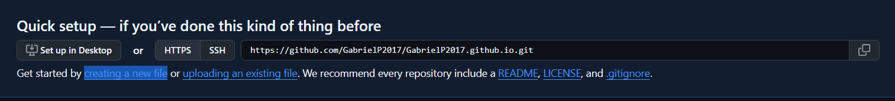

# 202030222 이강민

## 2025.06.05(14주차)

### 2단계: 페이지 어디에서든 React 컴포넌트 렌더링하기 

```jsx
import { createRoot } from 'react-dom/client';

// 기존 HTML 컨텐츠를 지웁니다.
document.body.innerHTML = '<div id="app"></div>';

// 대신에 여러분이 작성한 React 컴포넌트를 렌더링합니다.
const root = createRoot(document.getElementById('app'));
root.render(<h1>Hello, world</h1>);
```
렌더링할 `<div>` 요소에 고유한 `id`를 부여하여
React 진입점에서 `document.getElementById`로 해당 요소를 찾아 컴포넌트를 연결

**createRoot(script,변수)** : 해당 요소 내부에 React 컴포넌트를 렌더링

**.render()** : 안에 적힌 내용을 연결해줌.

```jsx
import { createRoot } from 'react-dom/client';

function NavigationBar() {
  // TODO: 실제로 네비게이션 바를 구현합니다.
  return <h1>Hello from React!</h1>;
}

const domNode = document.getElementById('navigation');
const root = createRoot(domNode);
root.render(<NavigationBar />);
```
- **기존 HTML 유지**: 기존에 작성된 `index.html`의 원본 콘텐츠는 삭제되지 않고 그대로 남아 있다.
- **영역 지정 렌더링**: `<nav id="navigation">` 요소 안에만 React로 구현한 `NavigationBar` 컴포넌트가 삽입된다.
- **점진적 도입 권장**:  
  1. 작은 상호작용 컴포넌트(예: 버튼)부터 React로 만들어보기.  
  2. 점차 상위 구조(페이지의 일부 섹션 → 페이지 전체)로 확장  
  3. 최종적으로 페이지 전체를 React 프레임워크 기반으로 마이그레이션하는 것을 추천

---

> ## 에디터 설정하기

### 에디터

| 에디터       | 주요 특징                                                          |
|-------------|-------------------------------------------------------------------|
| **VS Code**    | - 가장 많이 사용하는 에디터<br>- 무수한 확장Extension 지원<br>- GitHub 등 외부 서비스 연동 용이  |
| **WebStorm**   | - JavaScript/React에 특화된 IDE<br>- 코드 완성, 리팩토링, 디버깅 도구 내장                   |
| **Sublime Text** | - 경량 에디터로 빠른 실행 속도<br>- JSX 및 TypeScript 기본 지원<br>- 문법 강조 및 자동 완성 제공 |
| **Vim**         | - UNIX 및 macOS에 기본 탑재된 텍스트 편집기<br>- 커맨드 기반 효율적 텍스트 편집<br>- 플러그인으로 확장 가능 |

### 에디터 기능 추천

#### 린팅(Linting)
- **정의**: 코드 작성 중 실시간으로 오류나 스타일 위반을 검사하여 개발자가 즉시 수정할 수 있도록 돕는 도구.  
- **ESLint**  
  - JavaScript용으로 가장 널리 쓰이는 린터.
  - **설치 전제 조건**: Node.js가 설치되어야 한다. (`npm install eslint --save-dev` 등).  
  - **React용 설정**  
    1. `eslint-plugin-react-hooks` 플러그인은 React 훅 규칙을 체크
       - **역할**: `useState`, `useEffect` 등의 훅 규칙(배열 의존성, 최상위 호출 등)을 강제하여, 잠재적 버그를 사전에 방지
    2. `eslint-config-react-app`  
       - Create React App(CRA)에서 권장하는 ESLint 설정 프리셋
       - CRA 프리셋에는 이미 `eslint-plugin-react-hooks` 규칙이 포함되어 있어 별도 수동 활성화 없이도 기본 훅 규칙을 적용할 수 있다.

#### 포맷팅(Formatting)
- **정의**: 코드 스타일(탭 vs 공백)을 자동으로 일관되게 정리해 주는 도구.
- **Prettier**
  - 설정해 둔 규칙(예: 탭 너비, 세미콜론 유무, 따옴표 유형 등)에 맞춰 코드를 포맷팅
  - 저장 시점에 자동 실행하도록 하면, 팀원 간 코드 스타일 차이로 인한 논쟁을 예방

- **VS Code에서 Prettier 설치 및 자동 포맷팅 설정**  
  1. VS Code 실행하기
  2. 퀵오픈 (Ctrl/Cmd + P)에서 `ext install esbenp.prettier-vscode` 입력 후 설치
  3. 저장할 때마다 자동 포맷팅
     - Ctrl/Cmd + Shift + P 입력 → “Settings” 선택
     - 검색 창에 “format on save” 입력
     - “Format On Save” 옵션이 **체크**되어 있는지 확인

> ## TypeScript 사용하기

TypeScript는 JavaScript 코드 베이스에 타입 정의를 추가하는 데 널리 사용되는 방법. 

기본적으로 TypeScript는 JSX를 지원하며, @types/react 및 @types/react-dom을 추가하면 완전한 React Web 지원을 받을 수 있다.

### 설치

모든 프로덕션 수준의 React 프레임워크는 TypeScript 사용을 지원한다. 프레임워크별 설치 가이드를 따르기!

[Next.js](https://nextjs.org/docs/app/api-reference/config/typescript)<br>
[Remix](https://remix.run/docs/en/1.19.2/guides/typescript)<br>
[Gatsby](https://www.gatsbyjs.com/docs/how-to/custom-configuration/typescript/)<br>
[Expo](https://docs.expo.dev/guides/typescript/)<br>

### 기존 React 프로젝트에 TypeScript 추가하기 

최신 버전의 React 타입 정의를 설치
```
npm install @types/react @types/react-dom
```
다음 컴파일러 옵션을 tsconfig.json에 설정.

1. dom은 lib에 포함되어야 한다!!(⚠️: lib 옵션이 지정되지 않으면, 기본적으로 dom이 포함됩니다).
2. jsx를 유효한 옵션 중 하나로 설정. 대부분의 애플리케이션에서는 preserve로 충분.

> tsconfig.json 설정
```jsx
{
  "compilerOptions": {
    "lib": ["dom"],
    "jsx": "preserve"
  }
}
```

### React 컴포넌트가 있는 TypeScript

**⚠️중요!!⚠️**
- JSX를 포함하는 모든 파일은 .tsx 확장자를 사용해야 한다. 
- TypeScript에게 해당 파일이 JSX를 포함하고 있음을 알려준다.

- **React + TypeScript 작성 방식**  
  - JavaScript로 React 작성과 매우 유사 
  - 가장 큰 차이점은 컴포넌트의 props에 타입을 제공할 수 있다는 점
  - 타입을 제공하면 에디터에서 정확성 검사와 인라인 문서 기능을 활용 가능

```tsx
function MyButton({ title }: { title: string }) {
  return (
    <button>{title}</button>
  );
}

export default function MyApp() {
  return (
    <div>
      <h1>Welcome to my app</h1>
      <MyButton title="I'm a button" />
    </div>
  );
}
```
- **샌드박스 환경 주의사항**
  - 이 문서에 있는 샌드박스들은 TypeScript 코드를 다룰 수는 있지만, 타입 검사는 수행하지 않음.
  - 타입 오류나 경고를 보려면 TypeScript Playground나 더 완전한 기능을 갖춘 온라인 샌드박스를 사용해야 한다.

- **interface 또는 type 사용 권장**
  - 인라인 타입 지정은 필드가 많아지면 다루기 어려워질 수 있다!!
  - 대신 interface나 type을 사용해 props를 설명하는 것을 권장.

```tsx
interface MyButtonProps {
  /** 버튼 안에 보여질 텍스트 */
  title: string; // props에 타입을 지정해줬다!!
  /** 버튼이 상호작용할 수 있는지 여부 */
  disabled: boolean; // props에 타입을 지정해줬다!!
}


function MyButton({ title, disabled }: MyButtonProps/* props에 타입을 지정해줬다!! */) {
  return (
    <button disabled={disabled}>{title}</button>
  );
}

export default function MyApp() {
  return (
    <div>
      <h1>Welcome to my app</h1>
      <MyButton title="I'm a disabled button" disabled={true}/>
    </div>
  );
}
```
- **props 타입 설명 가이드**
  - 컴포넌트의 props 타입은 원하는 만큼 단순하거나 복잡할 수 있dj 반드시 객체 타입으로 type 또는 interface를 사용해야 한다.

> ## Hooks 예시및 종류

- `@types/react`에는 내장 Hooks에 대한 타입 정의가 포함되어 있어, 추가 설정 없이 컴포넌트에서 바로 사용 가능

- 컴포넌트 코드를 기반으로 대부분의 타입이 자동으로 추론되므로, 별도의 사소한 타입 제공 작업이 거의 필요 없음.

### useState 

**초기값으로 타입 추론**
```tsx
// 타입을 "boolean"으로 추론합니다
const [enabled, setEnabled] = useState(false);
```
`enabled`: `boolean`
`setEnabled`: `boolean` 또는 `() => boolean`을 인수로 받는 함수

**명시적 타입 지정**
```tsx
// 명시적으로 타입을 "boolean"으로 설정합니다
const [enabled, setEnabled] = useState<boolean>(false);
```

**유니언 타입 상태**
```tsx
type Status = "idle" | "loading" | "success" | "error";

// Status 유니언 타입을 지정
const [status, setStatus] = useState<Status>("idle");
```

**객체 기반 상태 구조화**
```tsx
type RequestState =
  | { status: 'idle' }
  | { status: 'loading' }
  | { status: 'success', data: any }
  | { status: 'error', error: Error };

// RequestState 객체 유니언 타입을 지정
const [requestState, setRequestState] = useState<RequestState>({ status: 'idle' });
```

[ 아래는 훑어보기만 한다 ]

**useRenducer** : useState보다 복잡한 상태로 로직을 처리할 때 사용<br>

**useContext** : 어떤 값을 전역으로 공유하고 싶을 때<br>

**useMemo** : 계산된 결과 값을 기억. 자주 계산해야하는데 값은 똑같을 때 다시 계산할 때 꺼내오는 것. 메모화 해두는 것.<br>

**useCallback** : 함수를 기억. useMemo와 비슷하다.

#### 총 정리

| Hook        | 용도             | 언제 사용하면 좋은가                          |
|-------------|------------------|---------------------------------------------|
| useState    | 단순 상태 저장     | 대부분의 기본 상태                           |
| useReducer  | 복잡한 상태 로직   | 폼, 상태 변경이 많은 컴포넌트                  |
| useContext  | 전역 상태 공유     | 로그인, 테마 등 여러 컴포넌트 공유 데이터         |
| useMemo     | 값 캐싱           | 계산 비용이 큰 작업 최적화                     |
| useCallback | 함수 캐싱         | 함수를 props로 넘길 때, 리렌더 방지             |

> ## React 프로젝트 배포하는 법 ( github )

GitHub Pages를 운영하려면 **GitHub Pages 저장소**를 생성.

저장소 이름은 **도메인 형태**로 해야한다. 또한 최상위 도메인은 `.com`이 아니라 `.io`로 해야한다.

- 저장소 생성 후 작업 방법
  - GitHub 웹에서 저장소를 만들었다면, 로컬로 **clone**한 뒤 작업하고 **push**
  - 처음부터 로컬에서 저장소를 만들었다면, 그대로 **push**

이 저장소는 **Github 정적 호스팅**을 하기 위해선 반드시 필요하다.

다른 이름의 저장소도 페이지로 사용 가능하다.

- 기본 저장소: https://<내 깃허브 아이디>.github.io
- 일반 페이지 저장소 : https://<내 깃허브 아이디>.github.io/<레포지토리 이름>

### 기본 저장소 생성및 접속

# 정적 사이트만 가능. (동적 사이트-실시간으로 뭔가 해야하는 것은 잘 안됨!!)
# DB,백엔드 를 직접 호출할 수 없다.

> 본인 계정으로 접속해서 레퍼지토리(repository)를 만들고 **public**으로 생성한다.
<br>💡이유 : Private하면 사람들이 접속이 안되고 접속하게 하려면 유료.


> Github에서 파일을 만드려면 creating a new file 링크를 클릭한다.



> 아래는 코드를 작성한다.


> 작성이 끝나면 commit을 하고 잠시 후에 브라우저로 접속하기. https://gabrielp2017.github.io/ 로 가면된다.

> ## 추가 페이지 만들 수 있는가?
> GitHub 계정당 “사용자(또는 조직) 페이지”는 **단 하나**만 만들 수 있다.<br>
> <아이디>.github.io 저장소는 오직 **하나만 존재**<br>
> 추가로 페이지를 만들고 싶다면 “프로젝트 페이지”로 생성.<br>
> ( https://<아이디>.github.io/<저장소이름>/ )

### 배포할 프로젝트 저장소 생성

아래는 슬라이드 내용을 Markdown 형식으로 정리한 예시입니다.

1. **로컬에 프로젝트 생성 및 준비**

   * 작업할 디렉터리(Working directory)에 새 프로젝트를 생성

2. **GitHub에 프로젝트 푸시**

   * 로컬에서 변경사항(commit) 후 원격 저장소(GitHub)에 push한다.
   * ※ 이때 GitHub 저장소(Repository)는 **public** 으로 설정해야 한다.

3. **GitHub Pages 활성화**

   1. GitHub 웹사이트에서 해당 저장소로 이동한 뒤,
   2. 우측 상단의 **Settings** 탭을 클릭한다.
   3. 왼쪽 메뉴에서 **Pages**(혹은 `Settings > Pages`) 항목을 찾는다.
   4. Pages 설정 화면 중 “Build and deployment” 섹션에서

      * **Source** 를 “Deploy from a branch” 로 선택하고,
      * **Branch** 옵션에서 `main`(또는 `master`) 브랜치를 선택한 뒤
      * **Save** 버튼을 눌러 저장한다.
   > **Tip:**
   > 초기에는 “None” 으로 되어 있을 수 있으므로, 클릭 후 `main`(또는 `master`)을 지정해야 Pages가 활성화된다.

   

4. **배포 결과 확인**

   * 설정을 저장한 뒤 1\~2분 정도 기다리면,
   * 브라우저에 다음 URL을 입력하여 배포된 페이지를 확인할 수 있다.

     ```
     https://<GitHub아이디>.github.io/<저장소이름>
     ```
   * 현재 프로젝트가 빌드(빌드 스크립트 등)되지 않은 상태라면,
     기본적으로 `README.md` 내용만 표시된다.

---

## 요약

* 로컬에서 프로젝트 준비 → GitHub에 push → Settings > Pages에서 브랜치 지정 → Save
* 잠시 후 `<아이디>.github.io/<Repo-name>` 에서 배포된 페이지(최초엔 README) 확인

이 과정을 거치면 GitHub Pages를 통해 정적 사이트(또는 빌드된 결과물)를 호스팅할 수 있으며, 빌드 스크립트를 추가하면 곧바로 HTML/CSS/JS 파일을 배포할 수 있습니다.

---

> # 마치며...

개발자 도구(useRenducer~), 컴파일러는 따로 학습하기.

## 이번 강의에서 학습한 Get Started
1. **Quick Start**
   - React의 전체 내용을 빠르게 학습할 수 있도록 개괄적인 설명 제공
   - Tic-Tac-Toe 게임 개발을 통해 React의 주요 개념을 실제 프로젝트에 적용하는 방법 소개
   - React 프로젝트의 단계별 개발 과정을 순서대로 설명
2. **Installation**
   - 다양한 프로젝트 상황에 맞춰 React를 도입하는 방법 학습
3. **Setup**
   - 개발 환경 설정 및 TypeScript 도입 방법 학습

## Learn React 학습 주제
- **UI로 표현하기**  
  - Quick Start에서 학습한 내용을 심화하여 UI 작성 기법을 학습
- **상호작용 더하기**  
  - State 개념을 심화하여 컴포넌트 간 상호작용 구현 방법을 학습
- **State 관리하기**  
  - 고급 상태 관리 기법 학습  
  - `useState` 외에 `useReducer`, `useContext` 등을 활용하는 방법 설명
- **Escape Hatches (예외적 처리 방법)**  
  - React 외부 시스템과의 제어 및 동기화 방법  
  - 고급 심화 과정을 다룸

복습 시 `Quick Start` 를 주로 보면 된다.

## 2025.05.29(13주차)

### 애플리케이션 성능 개선

앱을 처음에는 클라이언트 전용 SPA로 시작하더라도, 나중에 다양한 렌더링 패턴을 도입해 성능과 유연성을 높일 수 있다.

1. SPA (단일 페이지 앱) : 기본
- **동작 방식**: 단일 HTML 페이지를 로드한 뒤, 사용자와 상호작용할 때만 화면을 동적으로 업데이트  
- **장점**: 설정이 간단하고 빠르게 시작 가능  
- **단점**: 초기 로드 시간이 느릴 수 있음

우리가 선택했던 빌드 도구(Vite, Parcel, Rsbuild)들은 SPA만 지원하므로 아래와 같은 다른 랜더링 패턴을 구현해야한다.

2. SSR (서버 사이드 랜더링)
- **동작 방식**: SSG와 유사하지만 매 요청 시 서버에서 정적 페이지 생성
- **장점**: 초기 로드 성능 개선  
- **단점**: 설정·유지 관리 복잡 (스트리밍 기능 추가 시 더욱 어려워짐)  

3. SSG (정적 사이트 생성)
- **동작 방식**: 빌드 시점에 정적 HTML 파일 생성 
- **장점**: CDN 배포로 빠른 응답 속도  
- **단점**: 빌드 설정·유지 관리가 SSR보다 복잡  

4. RSC (React 서버 컴포넌트) 
- **동작 방식**: 서버 전용 컴포넌트와 인터랙티브 컴포넌트를 하나의 트리에서 혼합. 서버에서 동작하는 컴포넌트로 DB 접근 가능.
- **장점**: 빌드 타임 최적화, 클라이언트 번들 경량화  
- **단점**: 전문 지식 필요, 설정·유지 관리 복잡  

🔗 올바른 렌더링 전략
- **경로별 전략 선택**:  
  - 랜딩 페이지 → SSG
  - [콘텐츠 피드](. "사용자들이 자주 업데이트되는 콘텐츠를 쉽게 받아볼 수 있도록 제공되는 형식 또는 스트림") 페이지 → SSR
- **이점**:  
  - 콘텐츠의 첫 바이트를 로드하는 데 걸리는 시간(TTFB),<br>
    콘텐츠의 첫 번째 부분을 렌더링하는 데 걸리는 시간(FCP),<br>
    앱에서 가장 큰 표시 콘텐츠를 렌더링하는 데 걸리는 시간(LCP)<br>
    == 전부 줄일 수 있다.
  - 앱 전체를 다시 작성하지 않고도 다양한 전략 적용  

## 중요⚠️ : 위의 모든걸 통합시킨 프레임워크를 사용할 것! = Next.js

---

> ## 기존 프로젝트에 React 추가하기

[인터랙티브 기능](. "사용자와 시스템간의 상호 작용을 가능하게 하는 기능")을 추가하고 싶다고 react로 프로젝트를 다시 작성할 필요는 없다.
기존 스택에 React를 추가하면 된다.

### 기존 웹사이트의 하위 경로 전체에 React 사용하기

예를 들어 Rails, Django 같은 전통적인 서버 기술로 빌드된 기존 웹 앱(`example.com`)이 있고, 그 하위 경로인 `/some-app/`에 해당하는 모든 요청을 React로 완전 대체하고 싶다면 아래와 같이 한다.

1. **React 기반 프레임워크 선택 및 빌드**  
   - React를 위한 프레임워크 중 하나(Next.js, Gatsby 등)을/를 골라 앱의 React 부분을 빌드

2. **Base Path 지정**  
   - 선택한 프레임워크 설정에서 `/some-app`을 “기본 경로(Base Path)”로 명시.( Base Path 사용법 : [Next.js](https://nextjs.org/docs/app/api-reference/config/next-config-js/basePath), [Gatsby](https://www.gatsbyjs.com/docs/how-to/previews-deploys-hosting/path-prefix/))

3. **서버 또는 프록시 구성**  
   - 기존 서버(Rails 등) 또는 리버스 프록시(Nginx, Apache 등) 설정을 통해 `/some-app/` 경로로 들어오는 모든 요청을 React 앱으로 포워딩

```diff
+ 💡 React 기반의 프레임워크들은 대부분 **풀스택**이며 앱이 서버를 활용할 수 있도록 해준다.
```

  > 서버 실행 환경에 따른 추가 고려사항 ⚙️

- **서버에서 JS 실행 불가능하거나 원치 않을 때**
  - Next.js의 `next export`, Gatsby의 기본 정적 내보내기 기능을 사용하여 HTML/CSS/JS 형태로 내보낸 결과물을 `/some-app/`경로에 제공.

### 기존 페이지의 일부분에 React 사용하기 

이미 다른 기술(Rails, Backbone 등)으로 구축된 페이지에 React 컴포넌트를 삽입해 상호작용 기능을 추가하는 방법.

1. **자바스크립트 환경 설정**  
    1. JSX 구문이 동작하도록 빌드 도구(Babel, Webpack 등)를 설정
    2. ES 모듈(`import`/`export`) 방식을 도입해 코드를 모듈로 분리 
    3. npm 패키지 레지스트리(React 등) 설치.

2. **컴포넌트 렌더링**  
   - 기존 페이지 내 원하는 위치(예: 특정 DOM 엘리먼트)에 React 컴포넌트를 마운트

> 세부 고려사항 🔍

#### 1단계: 모듈 자바스크립트 환경 설정하기

-모듈 자바스크립트 환경을 구축하면 React 컴포넌트를 각각 개별 파일로 작성할 수 있다.
- React 자체를 포함한 다양한 npm 패키지를 활용할 수 있다.

> 작업을 수행하는 방법 ⚙️

**애플리케이션이 이미 `import` 문으로 파일을 분리하고 있을 때**
   - 기존 빌드 파이프라인을 그대로 사용하기.
   - JSX 문법(`<div />` 등)을 작성해 보고 문법 오류가 나는지 확인.
   - JSX 관련 문법 오류가 발생한다면, Babel을 이용한 코드 변환 필요하다. => JSX 사용을 위해 **Babel React 프리셋**을 활성화 하기.

**자바스크립트 모듈을 컴파일하기 위한 기존 설정이 없을 떄**
  - Vite를 이용하여 설정.
  - Vite는 Rails, Django, Laravel 등의 백엔드와 공식 통합을 지원
  - 목록에 없는 백엔드라면, Vite 가이드를 참고해 수동으로 빌드 출력을 통합.

설정이 제대로 동작하는지 확인하려면 프로젝트 폴더에서 아래 명령어를 실행
```
npm install react react-dom
```
그리고 메인 자바스크립트 파일(index.js 혹은 main.js 같은 것)의 최상단에 다음 코드 라인을 추가
```jsx
import { createRoot } from 'react-dom/client';

// 기존 HTML 컨텐츠를 지웁니다.
document.body.innerHTML = '<div id="app"></div>';

// 대신에 여러분이 작성한 React 컴포넌트를 렌더링합니다.
const root = createRoot(document.getElementById('app'));
root.render(<h1>Hello, world</h1>);
```

⚠️ 처음으로 기존 프로젝트에 모듈 자바스크립트 환경을 통합하기는 다소 어려워 보일 수 있으니 어려움을 겪는 부분이 있다면 [커뮤니티 리소스](https://ko.react.dev/community)나 [Vite 채팅](https://discord.com/invite/aYVNktYeEB)을 이용할 것.

## 2025.05.22(12주차)

- 요즘은 create-react-app 보다 Vite, Next.js를 많이 쓴다.

> ## 프로젝트에 도입하기

React는 **점진적 적용**이 가능하도록 설계.
즉, 필요한 만큼만 React를 도입해도 되고, 나중에 더 확장해도 무방하다. 

- **HTML 페이지에 살짝 섞어 쓰기**  
  - 기존 정적 페이지에 약간의 상호작용을 추가하고 싶을 때  
- **맛보기로 경험해보기**  
  - React가 어떻게 동작하는지 가볍게 맛보고 싶을 때  
- **풀스케일 앱 시작하기**  
  - 처음부터 React 기반의 복잡한 애플리케이션을 구축하고자 할 때

---

### React 시도하기

local에서 react를 사용하고 싶다면 Node.js 설치.

React 문서 외에도 [CodeSandbox](https://codesandbox.io), [StackBlitz](https://stackblitz.com/), [CodePen](https://codepen.io/) 등의 온라인 샌드박스에서도 React 지원

---

### 새로운 React 앱 만들기

React로 새 앱이나 웹사이트를 만들 때는 **프레임워크 활용**이 가장 쉽고 빠른 방법!!

🚀 프레임워크 사용 이유

- **모든 기능 지원**  
  - 프로덕션 배포, 확장, 최신 React 아키텍처 통합  
- **간편 호스팅**  
  - [CDN][cdn] 이나 정적 호스팅에 곧바로 배포 가능 (서버 불필요)
- **유연한 렌더링**  
  - CSR(클라이언트 측 렌더링), SPA(단일 페이지 앱), SSG(정적 사이트 생성) 기본 지원 + 필요할 때 경로별 서버 사이드 렌더링 추가

[cdn]:https://developer.mozilla.org/en-US/docs/Glossary/CDN, " 전 세계에 분산된 캐시 서버를 통해 웹 리소스를 사용자 근처에서 제공함으로써 속도, 안정성, 보안을 크게 향상시키는 기술"

🔧 직접 빌드가 적합한 경우

1. 기존 프레임워크에서 지원되지 않는 **특별 제약**이 있을 때  
2. **나만의 프레임워크**를 만들어보고 싶을 때  
3. React의 **기본 개념 학습**에 집중하고 싶을 때  

<br>

**풀스텍 프레임워크**
- 권장 프레임워크는 프로덕션에서 앱을 배포하고 확장하는데 필요한 모든 기능을 지원
- 최신 React기능을 통합, React의 아키텍처를 활용

⚙️ 풀스택 프레임워크 핵심

- **클라이언트 전용으로 시작** → 나중에 서버 기능 단계적 도입  
- **CSR(클라이언트 렌더링)**
- **SPA(단일 페이지 앱)**
- **SSG(정적 사이트 생성)**

> 💡 필요에 따라 “경로별 서버 렌더링”만 추가하면 된다! 

---

### 프레임워크 종류

| 프레임워크                     | 주요 특징                                                                                                                                                                  |
|-------------------------------|---------------------------------------------------------------------------------------------------------------------------------------------------------------------------------------------------------------------------------------------------------------------------------------|
| **Next.js (앱 라우터)**       | 풀 스택 React 앱을 활성화하는 프레임워크<br>Vercel에서 유지 관리<br>Node.js 서버리스 또는 자체 서버에 배포<br>서버가 필요 없는 정적 내보내기 지원<br>유로(유료) 클라우드 서비스도 지원                                                                      |
| **React Router (v7)**        | 가장 인기 있는 라우팅 라이브러리<br>Vite와 결합 시 풀스택 React 프레임워크 구성 가능<br>표준 Web API 강조<br>다양한 JS 런타임·플랫폼용 배포 템플릿 제공<br>Shopify에서 유지 관리                                                                                   |
| **Expo (네이티브 앱용)**     | 안드로이드 · iOS · 웹용 범용 앱 제작 가능한 React 프레임워크<br>네이티브 기능 접근용 React Native SDK 제공<br>Expo(회사)에서 유지 관리<br>무료로 앱 빌드 및 스토어 제출 가능<br>추가 유료 클라우드 서비스 제공                                                         |

🌱 떠오르는 풀스택 React 프레임워크

*TanStack Start (Beta)*
- **TanStack Router** 기반의 풀스택 React 프레임워크  
- Nitro, Vite와 유사한 기능 제공
  - 전체 문서 SSR  
  - 스트리밍  
  - 서버 함수  
  - 번들링  
- 개발 생산성을 높여주는 다양한 도구 포함  

*RedwoodJS*
- 풀스택 웹 앱을 쉽게 만들도록 **사전 탑재된 패키지 & 설정** 제공  
- **빠른 스타트업**과 일관된 개발 경험에 최적화  

---

### 프레임워크 자체 제작

🔍 기존 프레임 워크를 사용하지 않고 직접 하는게 좋을 경우

- 기존 프레임워크에 **특별한 제약**이 있을 때  
- **나만의 프레임워크**를 만들어보고 싶을 때  
- React의 **기본 개념**을 깊이 배우고 싶을 때 

✅ 장점
- **더 많은 유연성** 확보 가능  
    - ⚠️하지만 **라우팅**, **데이터 가져오기**, 기타 **일반적인 패턴**에 사용할 도구를 직접 선택해야 한다.
- 이미 존재하는 프레임워크 대신 **자체 구조**를 설계하는 것과 비슷

---

> ### 1단계: 빌드 도구 설치

앱을 처음부터 시작할 때는 **Vite**, **Parcel**, **rsbuild** 등과 같은 빌드 도구를 설치.<br>
이들 도구는 다음 기능을 제공한다.
- **소스 코드 패키징**: 작성한 파일을 하나로 묶어 효율적으로 관리  
- **로컬 개발 서버**: 변경 사항을 실시간으로 확인하며 개발  
- **프로덕션 빌드**: 최적화된 파일을 생성해 서버에 배포  

React 공식 빌더 : create-react-app(CRA).

### **Vite** : ✨추천✨

Vite는 최신 웹 프로젝트를 위해 설계된 **고속 빌드 도구** 

```
npm create vite@latest my-app -- --template react
```
1. **빠른 새로고침**  
   - 코드 변경 즉시 반영되어 개발 효율성 ↑
2. **JSX 지원**  
   - React 문법을 바로 사용할 수 있음
3. **플러그인 생태계**  
   - Babel, SWC 등과 연동 가능한 다양한 플러그인
4. **합리적 기본 설정**  
   - 별도 설정 없이도 생산성 높은 환경 제공
5. **프레임워크 통합**
   - React Router, Next.js 등 주요 프레임워크의 기본 빌드 도구로 활용

### **Parcel**
```
npm install --save-dev parcel
```

**뛰어난 기본 개발 경험**과 **확장 가능한 아키텍처**를 결합 
프로젝트의 초기 단계부터 대규모 프로덕션 애플리케이션까지 자연스럽게 성장할 수 있도록 돕는다.

- **빠른 새로고침**  
- **JSX** 및 **TypeScript** 지원  
- **Flow** 타입 검사 지원  
- **스타일링**(CSS, Sass 등) 기본 지원  

### **Rsbuild**
```
npx create-rsbuild --template react
```

**Rspack**을 기반으로 한 React 전용 빌드 도구.
<br> 

세심하게 조정된 기본 설정과 **성능 최적화** 기능을 즉시 활용

- **빠른 새로고침**  
- **JSX** 및 **TypeScript** 지원  
- **스타일링**(CSS, Sass 등) 기본 지원  

### React Native용 Metro

React Native 프로젝트를 **처음부터** 설정하려면 JavaScript 번들러인 **Metro**를 사용.
그러나❗❗ 다른 빌드 도구에 비해 제공 기능이 제한적, **React Native 지원이 필요하지 않은** 웹 중심 개발이라면 Metro 대신 **Vite, Parcel, Rsbuild** 중 하나를 선택하는 것이 좋다!

- **플랫폼 번들링 지원**  
  - iOS, Android 등 React Native 앱용 코드 묶음 생성  
- **빠른 새로고침**  
  - 코드 변경 시 즉시 반영 가능  
- **경량 설계**  
  - React Native에 특화되어 가볍고 빠름  

⚠️ 고려할 점

- **기능 제한**  
  - 웹용 빌드 도구(Vite, Parcel, Rsbuild)에 비해 플러그인·확장 생태계가 좁음  
- **웹 개발 시 비추천**  
  - React Native가 아닌 순수 웹 프로젝트라면 다른 도구가 더 유연함  

---

> ### 2단계: 공통 애플리케이션 패턴 구축

위에서 소개한 빌드 도구(Vite, Parcel, Rsbuild 등)들은 **클라이언트 전용 SPA**를 빠르게 시작하는 데 특화되어 있지만, 다음과 같은 일반 기능은 별도 도구가 필요❗❗

- **라우팅**  
- **데이터 가져오기 (페칭/캐싱)**  
- **스타일링 (CSS-in-JS, 디자인 시스템 등)**  

React 생태계에는 이 기능들을 보완하는 다양한 도구가 있으므로, 필요에 따라 자유롭게 선택해 통합할 수 있다.  

### Routing: 라우팅

라우팅은 사용자가 특정 URL을 방문할 때 **어떤 콘텐츠나 페이지를 보여줄지 결정**
앱의 여러 부분에 URL을 매핑하려면 **라우터 설정**이 필요하며, 다음과 같은 기능을 처리해야 한다.

- **중첩된 경로**  
- **경로 매개변수** (URL 세그먼트 기반 파라미터)  
- **쿼리 매개변수** (검색어, 필터 등 추가 정보)  

라우터는 코드 내 설정 형태로 구성하거나, 파일 및 폴더 구조에 따라 자동으로 라우트를 정의할 수도 있다.

**🔗 라우터와 통합할 주요 기능**
1. **데이터 페치**
   - 페이지 렌더링 전에 필요한 데이터를 미리 가져와 빠른 로딩 구현  
2. **코드 분할**  
   - 페이지별 번들 크기를 최소화해 초기 로딩 최적화  
3. **페이지 렌더링 방식**  
   - CSR, SSR, SSG 등의 전략과 결합하여 각 페이지 생성 방식 결정

다음을 사용하는 것이 좋다.

- [리액트 라우터](https://reactrouter.com/start/data/custom)
- [Tanstack 라우터](https://tanstack.com/router/latest)

> 💡요약 : 간단하게 컴포넌트 분할을 해주는 것도 있지만, **어떤 URL에서 어떤 컴포넌트를 보여 줄지**를 일관성 있게 관리할 수 있다.
```jsx
return (
  <>
    <Header />
    <MainContent />
    <Footer />
  </>
);
// 이것처럼 해주는 것이 라우팅.
// 위를 아래처럼 바꿔주는 것이다.
  <BrowserRouter>
    <Routes>
      {/* path에 따라 해당 Component를 JSX로 렌더링 */}
      <Route path="/"      element={<Home />} />
      <Route path="/about" element={<About />} />
    </Routes>
  </BrowserRouter>
```

### Data Fetching: 데이터 미리 가져오기

애플리케이션에서 **서버나 외부 데이터 소스**에서 정보를 가져오는 것은 필수적이지만, 직접 구현하면 여러 상태 관리가 복잡해진다.

🚧 직접 구현 시 고려 사항
- **로딩 상태 관리**  
  - 화면에 스피너나 플레이스홀더 표시  
- **오류 상태 처리**  
  - 네트워크 실패나 서버 오류 대응  
- **캐싱 구현**  
  - 동일 요청 반복 방지 및 성능 최적화  

⚠️ 이 세 가지를 직접 다루면 코드가 산만해지고, 버그가 늘어날 수 있다!! ⚠️

특별히 제작된 라이브러리를 사용하면 위 작업을 대신 처리해 준다.  
일반적으로 컴포넌트에서 직접 호출하지만, 다음과 같은 이점을 위해 **라우터 로더**나 **서버 렌더링**과 통합할 수도 있다.

- **프리페칭(prefetching)**  
  - 링크나 경로 탐색 전에 미리 데이터 요청  
- **성능 최적화**  
  - 페이지 진입 시 필요한 데이터 일괄 로드  
- **서버 사이드 데이터 준비**  
  - 클라이언트 초기 렌더링 시점에 이미 데이터 확보  

🛠️ 데이터를 가져오는 경우 사용하는 툴

- 대부분의 백엔드나 REST 스타일 API
  - [React Query](https://tanstack.com/query/v3/)
  - [SWR](https://swr.vercel.app/ko)
  - [RTK Query](https://redux-toolkit.js.org/rtk-query/overview)

- GraphQL API
  - [Apollo](https://www.apollographql.com/docs/react)
  - [Relay](https://relay.dev/)

> 💡요약 : 로딩 상태, 오류 상태, 캐싱 구현 등은 직접 구현하지말고 데이터를 가져오자!!

### Code-splitting: 코드 분할

코드 분할은 애플리케이션을 **작은 묶음(청크)**으로 나누어, 사용자가 필요할 때 해당 코드만 로드하도록 하는 기법.

❓ 왜 코드 분할이 필요할까?
- 앱에 기능과 종속성이 늘어날수록 번들 크기가 커져 **초기 로드 속도**가 느려짐  
- 모든 코드를 한꺼번에 전송하면 대역폭 낭비 및 **최대 콘텐츠 페인트(LCP)** 지연 발생  

⚙️ 직접 분할 vs 통합 분할
1. **직접 분할**  
   - `React.lazy` 등으로 특정 컴포넌트만 지연 로딩  
   - **문제점**:  
     - **워터폴 현상** 발생 (차트 등 대규모 컴포넌트 로딩 시 두 번 대기 발생)  
2. **경로별 분할 & 데이터 페칭 통합**  
   - 라우팅 로더 또는 빌드 도구 수준에서 청크 생성  
   - 데이터 페칭과 함께 번들을 전송해 **동시에** 로드  
   - 초기 로드 및 LCP를 **효율적으로 단축**

- 경로별 분할 : 해당 URL(경로)에 대응하는 컴포넌트를 필요할 때 import() 해서 불러오기
```jsx
const Home = React.lazy(() => import('./pages/Home'));
```
- 데이터 페칭 통합 : 라우터 설정(또는 컴포넌트 바깥)에서 ‘이 경로에 필요한 데이터’를 미리 가져오고, 그 값을 컴포넌트에서 바로 꺼내 쓰기
```jsx
// 라우터 단계에서 fetch 실행
{
  path: '/about',
  loader: async () => fetch('/api/about').then(r => r.json()),
  element: <About />,
}
// 컴포넌트에서는 변수처럼 바로 사용
function About() {
  const data = useLoaderData();
  return <div>{data.text}</div>;
}

```

코드 분할 지침 : [Vite build optimizations](https://v3.vitejs.dev/guide/features.html#build-optimizations), [Parcel code splitting](https://parceljs.org/features/code-splitting/), [Rsbuild code splitting](https://rsbuild.dev/guide/optimization/code-splitting)

> 💡 요약 : 코드 분할로 초기 로드 속도 개선한다. 근데 직접 분할은 이슈가 발생할 수 있기에 경로별 분할과 데이터 페칭 통합을 쓸 것.

## 2025.05.15(11주차)

> ## React로 사고하기

### Step 3: 최소한의 데이터만 이용해서 완벽하게 UI State 표현 - 2

1. 예시 설명

1. **제품의 원본 목록**은 `props`로 전달되었기 때문에 **state ❌**.  
2. **사용자가 입력한 검색어**는 시간이 지남에 따라 변하고, 다른 요소로부터 계산될 수 없기 때문에 **state ✅**.  
3. **체크박스의 값**은 시간이 지남에 따라 바뀌고, 다른 요소로부터 계산될 수 없기 때문에 **state ✅**.  
4. **필터링된 제품 목록**은 원본 제품 목록을 받아 검색어와 체크박스의 값에 따라 계산할 수 있으므로, **state ❌**.  

**결론**:  
검색어와 체크박스의 값만이 **state**이다!

2. Props vs State

- **Props** : 부모가 자식에게 주는 읽기 전용 데이터
  - 부모 컴포넌트로부터 `전달`된 데이터
  - 읽기 전용 (read-only)
  - 예: 제품의 원본 목록 (`products`)

- **State** : 컴포넌트 내부에서 변경 가능한 메모리
  - 컴포넌트 내부에서 `변경` 가능한 데이터  
  - 시간이 지남에 따라 변화  
  - 예:  
    - 사용자가 입력한 검색어  
    - 체크박스의 선택 여부

✨ 요약 : props는 `읽기`만 하는 것/일반 데이터, State는 `변경` 가능 한 것으로 생각해서 할당해주자!! ✨

---

### Step 4: State가 어디에 있어야 할지 정하기

앱에서 최소한으로 필요한 state를 결정한 후, 다음으로 “어떤 컴포넌트가 해당 state를 소유하고 변경할 책임을 가질지” 정해야 한다.
React는 항상 부모 → 자식으로 데이터를 전달하는 **단방향 데이터 흐름**을 사용.

1. **렌더링 대상 파악**  
   - 해당 state를 기반으로 UI를 표시하는 모든 컴포넌트를 식별.

2. **공통 부모 탐색**  
   - 이들 컴포넌트의 계층에서 가장 가까운 공통 부모를 찾는다.
   - 보통 공통 부모 컴포넌트에 state를 선언.  
   - 필요 시 더 상위 컴포넌트에 선언해도 무방하다.

3. **전용 컨테이너 생성**  
   - 적절한 위치가 없으면, state전용 새 컴포넌트를 만들어 상위 계층에 추가.

> **팁**  
> 이전 단계에서 식별된 두 가지 state(검색어 입력, 체크박스 값)는 항상 함께 사용되므로 `같은 컴포넌트(또는 동일 부모)에 배치`하는 것이 합리적. = 같은 위치에 두기.

이 과정이면 `어떤 컴포넌트가 state를 소유하고 관리해야 하는지` 명확해진다.

> 적용 예시 팁

1. state를 쓰는 컴포넌트를 찾아보기
    - `ProductTable`은 state에 기반한 상품 리스트를 필터링. (검색어와 체크 박스의 값)
    - `SearchBar`는 state를 표시. (검색어와 체크 박스의 값)

2. 공통 부모를 찾아보기 : 둘 모두가 공유하는 첫 번째 부모는 `FilterableProductTable`이다.

3. 어디에 state가 존재해야 할지 정해보기 : 그렇기에 `FilterableProductTable` 안에 `filterText`와 `inStockOnly`를 state로 선언.

```jsx
function FilterableProductTable({ products }) {
  const [filterText, setFilterText] = useState(''); // 검색 필터링
  const [inStockOnly, setInstockOnly] = useState(false); // 재고가 있는지 필터링
  //...
}
```
그 후, `filterText`와 `inStockOnly`를 `ProductTable`와 `SearchBar`에게 props로 전달
```jsx
function FilterableProductTable({ products }) {
  const [filterText, setFilterText] = useState(''); // 검색 필터링
  const [inStockOnly, setInstockOnly] = useState(false); // 재고가 있는지 필터링

  return (
    <div>
      <SearchBar filterText={filterText} inStockOnly={inStockOnly} />
      <ProductTable filterText={filterText} inStockOnly={inStockOnly} products={products} />
    </div>
  );
}
```

이렇게 하면 폼이 수정되진 않지만 useState가 작동하는걸 확인할 수는 있다.
그리고 콘솔을 보면 아래와 같은 오류가 나타난다.
```diff
- You provided a value prop to a form field without an onChange handler. This will render a read-only field. If the field should be mutable use defaultValue. Otherwise, set either onChange or readOnly.
```
이것은 아직 사용자의 키보드 입력과 같은 행동에 반응하는 코드를 작성하지 않았기 때문에 나타나는 것이다.

---

### Step 5: 역 데이터 흐름 추가

이제 사용자 입력에 따라 state를 변경하려면 반대 방향의 데이터 흐름을 만들어야 한다.

- **문제점**  
  - `<input value={filterText}>`만 사용하면, 부모의 `filterText`가 변경되지 않아 입력이 무시.

- **해결 방안**  
  1. 부모 컴포넌트(`FilterableProductTable`)에  
     - `setFilterText`  
     - `setInStockOnly`  
     함수를 정의.  

  2. 이 함수들을 props로 자식 컴포넌트(`SearchBar`)에 전달한다.  

  3. `SearchBar`에서  
     - 텍스트 입력의 `onChange`  
     - 체크박스 입력의 `onChange`  
     이벤트 핸들러로 전달받은 함수를 호출하여 부모 state를 업데이트.

- **결과**
  - 단방향(props) 데이터 흐름에 더해, 콜백 함수를 통한 상향(state 변경) 흐름이 구현되어 사용자의 모든 입력이 UI에 즉시 반영.
  - 단방향으로 하는 이유 : 양방향보다 오류가 나더라도 쉽게 확인할 수 있다.

```jsx
function FilterableProductTable({ products }) {
  const [filterText, setFilterText] = useState(''); // 검색 필터링
  const [inStockOnly, setInstockOnly] = useState(false); // 재고가 있는지 필터링

  return (
    <div>
      <SearchBar filterText={filterText} inStockOnly={inStockOnly} onfilterTextchange={setFilterText} onisStockOnlychange={setInstockOnly} />
      {/* ... */}
```

`SearchBar`에서 `onChange` 이벤트 핸들러를 추가하여 부모 state를 변경할 수 있도록 구현 한다.

```jsx
function SearchBar({ filterText, inStockOnly, onfilterTextchange, onisStockOnlychange }) {
  return (
    <form>
      <input
        type="text"
        value={filterText}
        placeholder="Search..."
        onChange={(e) => onfilterTextchange(e.target.value)} /* js 문법 */
        /> 
      <label>
        <input
          type="checkbox"
          checked={inStockOnly} 
          onChange={(e) => onisStockOnlychange(e.target.checked)} /* js 문법 */
          />
```

## 2025.05.08(10주차)

> ## React로 사고하기

1. **사고 전환**  
   - React 사용 시 앱 설계 방식과 디자인 사고가 달라짐.
2. **컴포넌트 분할**  
   - UI를 작은 컴포넌트 단위로 쪼개어 설계.
3. **시각적 상태 정의**  
   - 각 컴포넌트별로 다양한 렌더링 상태(로딩, 에러, 정상 등)를 명시.
4. **데이터 흐름 연결**  
   - 컴포넌트 간에 Props나 Context를 통해 데이터가 유기적으로 전달되도록 설정.

💡React로 “검색 가능한 상품 테이블”을 구축하는 과정을 단계별로 학습하기
( 컴포넌트의 조각들이 어떻게 APP으로 완성되는지 확인 하기 )💡

---


### 모의 시안과 함께 시작하기 

이미 JSON API와 디자이너로부터 제공받은 모의 시안이 있다고 가정.

JSON API는 아래와 같은 형태의 데이터를 반환
```js
[
  { category: "Fruits", price: "$1", stocked: true, name: "Apple" },
  { category: "Fruits", price: "$1", stocked: true, name: "Dragonfruit" },
  { category: "Fruits", price: "$2", stocked: false, name: "Passionfruit" },
  { category: "Vegetables", price: "$2", stocked: true, name: "Spinach" },
  { category: "Vegetables", price: "$4", stocked: false, name: "Pumpkin" },
  { category: "Vegetables", price: "$1", stocked: true, name: "Peas" }
]
```


시안은 위와 같이 생겼으며 React로 UI를 구현하기 위해서 일반적으로 다섯 가지 단계를 거친다.

1. 컴포넌트를 계층으로 쪼개기
2. 정적인 버전을 구현
3. 최소한의 데이터만 이용해서 완벽하게 UI State 표현
4. State가 어디에 있어야 할지 정하기
5. 역 데이터 흐름 추가
---

### Step 1: 컴포넌트를 계층으로 쪼개기

1. **목업(Mock) 분석**  
   - 화면에 보이는 모든 컴포넌트와 하위 컴포넌트 주변에 사각형 박스를 그리고 이름을 붙인다. 
   - **⚠️디자이너가 이미 이름을 정해두었다면, 꼭 확인!!!⚠️**

2. **관점별 분할 기준**  
   - **Programming**  
     - 단일 책임 원칙을 적용해, 컴포넌트가 한 번에 한 가지 일만 하도록 설계.  
     - 기능이 커지면 작은 하위 컴포넌트로 쪼갠다.
      **(⚠️더하기,나누기 컴포넌트가 아닌 각 역할마다 컴포넌트를 나눈다. 역할 하나에 컴포넌트 하나씩!!⚠️)**
   - **CSS**
     - 클래스 선택자를 무엇으로 만들지 고려해 스타일링 경계를 정하기
     └> CSS는 id는 잘 안쓴다. js에서도 id를 쓰는데 이게 서로 햇갈리고 충돌날 수도 있기 때문에 대부분 class만 쓴다.
   - **Design**
     - 디자인 계층 구조를 어떻게 구성할지 고민 

3. **UI ↔ 데이터 모델 매핑**  
   - 잘 구조화된 JSON 데이터는 UI 컴포넌트 구조와 자연스럽게 대응. = UI 컴포넌트를 분리하고 각 컴포넌트가 데이터 모델에 매칭될 수 있도록 하기!!


1. **FilterableProductTable** (회색, ⚪) : 전체 예시를 감싸는 최상위 컴포넌트  
2. **SearchBar** (파란색, 🔵) : 사용자의 텍스트 입력을 받아 필터 조건을 제공
3. **ProductTable** (라벤더색, 🟣) : 데이터 리스트를 렌더링하고, SearchBar의 입력에 따라 필터링 
4. **ProductCategoryRow** (초록색, 🟢) : 각 카테고리별 헤더(제목)
5. **ProductRow** (노란색, 🟡) : 개별 제품 정보를 한 행(row)으로 표시

| 헤더 유형    | 조건 및 처리 방식 |
|------------|--------------------------------------------------------------------|
| 📝 단순 헤더   | “Name”과 “Price” 레이블만 있을 때<br>별도 컴포넌트 생성 없이 `ProductTable` 안에 직접 작성 |
| ⚙️ 복잡 헤더   | 정렬 버튼, 필터 옵션 등 추가 기능이 필요할 때<br>`ProductTableHeader` 같은 독립 컴포넌트로 분리 |

- 컴포넌트 계층 구조<br>
한 컴포넌트 내에 있는 다른 컴포넌트는 게층 구조에서 자식으로 표현.
```
FilterableProductTable
  └SearchBar
  └ProductTable
    └ProductCategoryRow
    └ProductRow
```
---

### Step 2: 정적인 버전을 구현

목표: 데이터 모델로부터 UI를 렌더링하는 정적 버전을 먼저 구현

이유:
- 정적 버전 → ‘많은 타이핑, 적은 사고’
- 상호작용 추가 → ‘적은 타이핑, 많은 사고’

순차적으로 접근하면 개발 난이도가 분리되어 관리하기 쉽다.

**정적 버전 구축 단계**

1. 데이터 모델 준비
    - 예시: 상품 목록, 사용자 정보 등

2. 컴포넌트 설계
    - 재사용 가능한 작은 컴포넌트부터 정의
    - 예: `ProductRow`, `ProductCategoryRow`

3. ★ props로 데이터 전달 ★
    - 부모 → 자식 컴포넌트
    - 💡`state`는 **사용하지 않음** ( 정적 버전을 만들고 있기 때문에 필요하지 않음. )
    - props를 이용하여 데이터를 넘겨주는 컴포넌트를 구현하는 것이 아주 좋다.

**컴포넌트 구성**

|           방향           | 특징                | 추천 시점               |
| :--------------------: | :---------------- | :------------------ |
| **하향식 (Top–Down)** | 상위 컴포넌트부터 순차 구현   | 작은 예제나 초기 설계        |
| **상향식 (Bottom–Up)** | 하위 컴포넌트부터 구현 후 조립 | 대규모 프로젝트, 테스트 개발 작성 |

- 간단한 프로젝트: `하향식`으로 빠르게 구조 파악
- 복잡한 프로젝트: `상향식` + 테스트 작성 → 안정성 ↑

**이후**
- 재사용 가능한 컴포넌트 라이브러리를 확보함
- 현재 정적 버전이기에 컴포넌트는 JSX만 반환
- 최상위 `FilterableProductTable` 컴포넌트가 prop으로 데이터 모델을 받아 데이터는 부모에서 자식으로만 전달되는 `단방향 데이터 흐름`구조를 가짐

---

### Step 3: 최소한의 데이터만 이용해서 완벽하게 UI State 표현

UI를 상호작용(interactive)하게 만들려면 사용자가 기반 데이터 모델을 변경할 수 있게 해야 한다. **React**는 이를 위해 **state**를 제공

1. State란 무엇인가? 🤔
- **기억해야 하는, 변경할 수 있는 데이터**의 최소 집합
- 앱이 동작하면서 변경되고, 화면에 반영되어야 하는 모든 데이터

> State는 앱이 기억해야 하는 데이터의 최소 집합

2. State 설계의 핵심 원칙

**중복배제 원칙 (Don’t Repeat Yourself)**
  - 필요한 **최소한의 state**만 정의. ( ⚠️한 아이템 에서 2개 이상 하지말라⚠️ )
  - 나머지 값들은 **다른 state**나 props를 통해 **실시간으로 계산**

**예시(쇼핑리스트)**
> 배열에 상품 아이템들을 넣는다.
UI에 상풍 아이템의 개수를 노출하고 싶다면, 따로 state 값으로 가지는게 아니라 단순하게 배열의 길이만 쓰기.
```js
// 잘못된 예: count를 별도의 state로 정의 -> 중복
const [items, setItems] = useState([]);
const [count, setCount] = useState(0);

// 올바른 예: items만 state로 관리, 개수는 items.length로 계산
const [items, setItems] = useState([]);
const count = items.length;
```

어떤 데이터가 State가 되어야 할까?

애플리케이션 예시 데이터(쇼핑리스트):
1. **제품의 원본 목록**  
2. **사용자가 입력한 검색어**  
3. **체크박스의 값**  
4. **필터링된 제품 목록**

🔍 State 판단을 위한 질문

1. **시간이 지나도 변하지 않는가?**  
   - 변하지 않는다면 → **State 아님** ❌
2. **부모로부터 props로 전달되는가?**  
   - props로 전달된다면 → **State 아님** ❌
3. **다른 state나 props로부터 계산 가능한가?**  
   - 계산 가능하다면 → **State 아님** ❌

> 위 세 가지 모두 해당되지 않는 **나머지 데이터**가 **State**여야 한다!


## 2025.04.18(보강-9주차)

### 한 번 더 state 끌어올리기

Board()안에 있던 useState를 Game()안에 넣기.
```js
export default function Game(){
    const [xIsNext, setXIsNext] = useState(true);
    const [history, setHistory] = useState([Array(9).fill(null)]); // Board()가 메인 컴포넌트가 아니니까 [squares, setSquares]를 history로 바꿔준다.
    // 게임의 진행 기록을 배열에 기억해 놓은걸 Game()으로 옮겨줌.
}
```
⚠️ 2차원 배열로 만들어 줘야만 9칸의 배열을 순서대로 저장한다.

현재 이동에 대한 사각형을 렌더링하려면 history에서 마지막 사각형의 배열을 읽어야 하기에,
배열을 불러온다.
```js
export default function Game(){
    const [xIsNext, setXIsNext] = useState(true);
    const [history, setHistory] = useState([Array(9).fill(null)]);

    const currentSquares = history[history.length - 1]; // 최근에 저장된 배열 가져오기. 마지막 배열을 가져와야하며 index는 0부터 시작하니 -1 해야함.
}
```

Game 컴포넌트에 `handlePlay` 함수를 정의한 뒤, `xIsNext`, `currentSquares`, `handlePlay`를 `Board`에 props로 전달.
```js
export default function Game() {
  const [xIsNext, setXIsNext] = useState(true);
  const [history, setHistory] = useState([Array(9).fill(null)]);
  const currentSquares = history[history.length - 1];

  function handlePlay(nextSquares) {
    // 새로 추가.
  }

  return (
    <div className="game">
      <div className="game-board">
        <Board xIsNext={xIsNext} squares={currentSquares} onPlay={handlePlay} /> {/* 함수를 보드로 전달. */}
  )
}
```

`Game()`에 `Board()`로 props를 전달했으니 Board()에도 props를 받도록 해야한다.

```js
export default function Game() {
  return(
    <>
      <Board xisnext={xisnext} squares={currentSquares} onPlay={handlePlay}/>
    </>
  )
  //...
}

// props를 전달해준다. {} 는 꼭 필수!!!
// {}가 없으면 매개변수를 하나만 받는걸로 하여 오류가 난다.

function Board({xisnext, squares, onPlay}) {
//...
}
```

`Board`함수 의 `handleClick`에서 `setSquares`와 `setXIsNext` 호출을 제거하고, 대신 단 하나의 `onPlay`만 호출 하도록 바꿔서 Game 컴포넌트가 보드 업데이트를 담당 하게 한다.
```js
function Board({xisnext, squares, onPlay}) {
  //... 
  function handleClick(i) {
    const nextSquares = squares.slice();

    if(squares[i] || calculateWinner(squares)){
      return;
    }

    if(xisnext){
      nextSquares[i] = "X";
    }else{
      nextSquares[i] = "O";
    }
    
/*  setSquares(nextSquares);
    setXIsnext(!xisnext); */

    onPlay(nextSquares); // 이거 하나만 호출하여 Game()에 업데이트 기능을 담당시킨다.
  }
}
```

배열을 가져와서 mextSquares에다가 추가하여 기록한다.
```js
export default function Game() {
  //...
  function handlePlay(nextSquares) {
    setHistory([...history, nextSquares]) // 옛날 기록을 가져와서 새 배열로 상태를 갱신한다.
    // history 의 모든 항목 열거
    setXIsnext(!xisnext); // 토글링. 턴 교체.
  }
}
```
**이렇게 하면 배열이 계속 갱신되며 그 배열들이 저장되어 최종적으로
모든 게임의 행동이 배열에 저장된다.**

---

### 보드가 깨지는 이유

- 일반적으로 하면 아래처럼 화면이 깨져보인다.<br>


- React는 하나로 매핑을 해줘야하는데 다음과 같이 되어있다.

>Square.jsx
```js
export default function Square({value, onSquareClick}) {

    return (
      <div>
          <button className="square"
          onClick={onSquareClick}>{value}</button>
      </div>
    );
  
  }
```
- div를 css를 안해주고 button만 스타일링 해줘서 다음 화면처럼 깨지게 보인다.
그렇기에 `<button>` 만 남기거나 `<>...</>`만 남겨준다.

---

### 과거 움직임 보여주기 

history에 게임의 과거 기록을 저장하므로 과거 이동 목록을 보여줄 수 있다.

- `<button>`과 같은 React 엘리먼트는 일반 JS객체이므로 애플리케이션에서 전달.
- 여러 엘리먼트를 렌더링하면 React 엘리먼트 배열을 사용함.
- state에 이동 `history` 배열이 있기 때문에 이것을 React 엘리먼트 배열로 변환.

- JS에선 한 배열을 다른 배열로 변환하려면 **배열 map 메서드**를 사용하면 된다.
```js
[1, 2, 3].map((x) => x * 2) // [2, 4, 6]로 변환.
```
> `map 함수의 사용`<br>
> 각각의 history 요소에 대한 {}의 실행문 실행.<br>
> 한마디로 각각의 배열의 길이만큼 for문을 돌리고 있는 것이다.


Game 컴포넌트에서 모든 플레이를 저장한 `history` 배열을 `map`으로 순회해,
각 이동마다 클릭 시 해당 턴으로 돌아가는 버튼 엘리먼트를 생성.
```js
export default function Game() {
 //...
  function jumpTo(nextmove) {
    
  }

 // history를 순회하며 각 이동에 대한 버튼 생성.
  const moves = history.map((square,move) =>{
    let description;
    if(move > 0){
      description = `${move}로 이동.`;
    }else{
      description = `게임 시작.`;
    }

    return(
      <li>
        <button onClick={() => jumpTo(move)}>{description}</button>
      </li>
    )
  })

  return(
    <div className='game' >
      <div className='game-board'>
        <Board xisnext={xisnext} squares={currentSquares} onPlay={handlePlay}/>
      </div>
      <div className='game-info'>
        <ol>{moves}</ol> {/* 위에 선언한 moves변수를 보여줌.  */}
      </div>
    </div>
  )

}
```

❗하지만 이렇게 만들면 콘솔에 아래와 같은 오류가 나온다
```diff
- Each child in a list should have a unique "key" prop. Check the render method of `Game`.
```
✅ key props를 지정해 달라는 말이다.

---

### Key 선택하기

React는 리스트를 렌더링할 때 각 항목을 추적해 두고,
업데이트 시 항목의 추가·제거·순서 변경·수정 등 어떤 부분이 바뀌었는지 빠르게 확인한다.

리스트가 다음과 같이 업데이트 되면

```js
<li>Alexa: 7 tasks left</li>
<li>Ben: 5 tasks left</li>
// ↓↓↓↓↓↓↓↓↓↓↓↓↓↓↓↓↓↓↓↓↓↓↓↓↓↓
<li>Ben: 9 tasks left</li>
<li>Claudia: 8 tasks left</li>
<li>Alexa: 5 tasks left</li>
```
`task`의 갯수가 업데이트 되고, `Alexa`와 `Ben`의 순서가 바뀌고 `Claudia`가 두 사람 사이에 추가되었다고 생각하게 된다.
<br>
⚠️그러나 React는 컴퓨터라서 우리가 의도한게 무엇인지 모른다.

✅ 그러므로 리스트 항목에 `key` 프로퍼티를 지정하여 각 리스트 항목이 **다른 항목과 다르다**는걸 **구별**해야한다.

| 제목         | 요약                                       |
|------------|------------------------------------------|
| `key`의 역할  | 리스트 항목을 구분하기 위한 내부 식별자 (컴포넌트 단위로만 고유) |
| 동작 방식     | 엘리먼트 생성 시 key를 저장하고, 업데이트 시 변경된 항목 판별에 사용 |
| 권장 사항     | 변하지 않는 고유 ID 사용. key 없으면 경고 후 인덱스 사용되며, 인덱스는 지양 |
| 경고 제거하기 | `key={i}`로 경고는 사라지나, 인덱스 사용 문제 발생—해시 등 안정적 값 권장 |

> 결론 : **key는 React의 list가 구별하기 위해 필요한 프로퍼티** 이다.

만약 데이터베이스에서 데이터를 불러와 사용한다면 해당 list들의 ID를 key값으로 쓸 수도 있다.
```js
<li key={user.id}>
  {user.name}: {user.taskCount} tasks left
</li>
```

그렇기에 `Game()`에서 key를 추가할 수 있으며 추가하면 에러가 사라진다. 리스트에다가 key값을 추가해준다.
```js
const moves = history.map((squares, move) => {
  //...
  return (
    <li key={move}> {/* key를 추가한다. */}
      <button onClick={() => jumpTo(move)}>{description}</button>
    </li>
  );
});

```

---

### 시간여행 구현

`key`를 통해 해당 기록의 `history` 배열의 기록된 데이터로 갈 수 있다.

시간여행을 구현하는 `jumpTo`를 만들기 전에 사용자가 현재 어떤 단계를 보고 있는지를 추적할 수 있는 `Game` 컴포넌트가 필요하다.
이를 위해 기본값이 0인 `Cmove` 라는 새 state 변수를 정의한다.
```js
  const [ Cmove, setMove ] = useState(0);
```

그리고 `jumpTo`함수를 구현한다.
```js
function jumpTo(nextmove) {
    setMove(nextmove);
    setXIsnext(nextmove % 2 === 0); // 짝수면 X, 홀수면 O
  }
```

`handlePlay`함수를 아래와 같이 변경한다.
```js
  function handlePlay(nextSquares) {
    const nexthistory = [...history.slice(0, Cmove + 1), nextSquares] // history배열 전체가 아니라 현재 시점만 복사 후 nextSquares에 붙여 새로운 기록으로 만듬.
    setHistory(nexthistory)
    setMove(nexthistory.length - 1); // 현재 이동한 위치를 기록
    setXIsnext(!xisnext);
  }
```
(0, Cmove + 1) : 0 ~ Cmove + 1 까지 전부 찾아준다. = 전부 포함<br>
❓만약 +1 이 없으면? : 0부터 Cmove 바로 전 까지만 가져온다.

`[history.length - 1]`인 항상 마지막 동작을 렌더링하는 대신 `Cmove` 으로 현재 선택한 동작을 렌더링하도록 `Game` 컴포넌트를 수정.
```js
export default function Game() {

  const [ Cmove, setMove ] = useState(0);
  const currentSquares = history[Cmove]; // 현재 이동한 위치의 상태를 가져옴.
  //...
}
```

### 최종 정리

코드를 자세히 살펴보면 Cmove가 짝수일 때는 `xIsNext === true`가 되고, Cmove가 홀수일 때는 `xIsNext === false`가 되는 것을 알 수 있다.

✅ Cmove의 값을 알고 있다면 언제나 xIsNext가 무엇인지 알아낼 수 있다.

**따라서 이 2개의 state를 모두 저장할 이유가 없다.**

```js
export default function Game() {
  const [history, setHistory] = useState([Array(9).fill(null)]);
  const [Cmove, setMove] = useState(0);
  const xIsNext = Cmove % 2 === 0; // 홀수면 X, 짝수면 O
  const currentSquares = history[Cmove];

  function handlePlay(nextSquares) {
    const nextHistory = [...history.slice(0, Cmove + 1), nextSquares];
    setHistory(nextHistory);
    setMove(nextHistory.length - 1);
    // 토글 지워짐.
  }

  function jumpTo(nextMove) {
    setMove(nextMove);
    // xIsNext가 대신해줌.
  }
  // ...
}

```
더 이상 `xIsNext` state 선언이나 `setXIsNext` 호출이 필요하지 않다. 이제 컴포넌트를 코딩하는 동안 실수를 하더라도 `xIsNext`가 `Cmove`와 동기화되지 않을 가능성이 없다.

**⚠️ 중복된 state는 에러를 불러온다! 중복시키지 말자!! ⚠️**

## 2025.04.17(7주차)

> ## state 끌어올리기

### 원리

1. handleClick 함수는 JavaScript의 slice() 배열 메서드를 사용하여 squares 배열의 사본 nextSquares를 생성.

2. handleClick 함수는 nextSquares 배열의 첫 번째 사각형(인덱스 [0])에 X를 추가하여 업데이트.

3. setSquares 함수를 호출.
squares의 state를 사용하는 컴포넌트(Board)와 그 하위 컴포넌트(보드를 구성하는 Square 컴포넌트)가 다시 렌더링

💡중요!!!
> JavaScript는 클로저를 지원하므로 내부 함수가(예: handleClick) 외부 함수(예: Board)에 정의된 변수 및 함수에 접근할 수 있다.
handleClick 함수는 squares의 state를 읽고 setSquares 메서드를 호출할 수 있는데, 이 두 함수는 Board 함수 내부에 정의되어 있기 때문.

❕결론 : 클로저 덕분에 handleClick 등 내부 함수가 Board 내의 squares 상태와 setSquares 함수에 자유롭게 접근한다.


보드에 X를 추가할 수 있게 되었지만 가능한 건 오직 왼쪽 위 사각형뿐 이기에 모든 사각형을 업데이트할 수 있도록 handleClick 함수를 수정한다.

```js
  function handleClick() {
    const nextSquares = squares.slice();
    nextSquares[0] = "X";
    setSquares(nextSquares);
  }

  // 위 코드를 아래 코드로 바꾼다.

  function handleClick(i) {
    const nextSquares = squares.slice();
    nextSquares[i] = "X";
    setSquares(nextSquares);
  }

```

다음으로 인수 i를 handleClick에 전달해야 한다.

❗하지만!!
```jsx
//Square의 onSquareClick prop를 아래와 같이 JSX에서 직접 handleClick(0)으로 설정할 수도 있지만 이 방법은 작동하지 않는다!!

<Square value={squares[0]} onSquareClick={handleClick(0)} />
```

💡이유
> 렌더 중 handleClick(0)을 직접 호출하면 setSquares가 상태를 바꿔 재렌더링되고, 그때 handleClick(0)도 다시 실행되어 무한 루프가 발생한다.

```❌ Too many re-renders. React limits the number of renders to prevent an infinite loop.```


이 문제를 해결하기 위해 
handleClick(0)을 호출하는 handleFirstSquareClick 함수를 만들고, handleClick(1)을 호출하는 handleSecondSquareClick을 만들고… 계속해서 만들어야 하지만 9개의 서로 다른 함수를 정의하고 각각에 이름을 붙이는 것은 너무 장황하니 다음과 같이 수정한다.

```js
//...
      <div className="board-row">
        <Square value={ squares[0] } onSquareClick={handleClick} />
{/* ... */}
{/* 다음과 같이 작성한다. */}
      <div className="board-row">
        <Square value={squares[0]} onSquareClick={() => handleClick(0)} />

```
화살표 함수로 짧게 정의하여 handleClick()함수를 호출하는데
매개변수의 숫자들을 호출하여 함수 호출을 간단하게 구현한다.

> 💡화살표 함수를 쓰는 이유 : 클릭 순간에만 함수를 호출하기 위해  화살표 함수를 쓰면 handleClick(0)을 호출하므로 원하는 i 값을 넘길 수 있다.

---

### 데이터 흐름 정리

1. **Board → Square**  
   *Board*가 `value`와 `onSquareClick`을 **props**로 내려줌 → Square가 화면을 올바르게 표시.
2. **Square → Board**  
   Square 클릭 → `onSquareClick` 실행 → Board의 `handleClick(i)` 호출 → **state 업데이트**.
3. **Board (재)렌더링**  
   `squares` state가 바뀌면 Board + 모든 Square가 자동으로 다시 렌더 → 화면 갱신.

---

### 왜 Board가 state를 갖고 있을가?

- **한곳**에서 9개 칸의 값을 관리해야 **승자 계산**과 같은 로직을 쉽게 구현할 수 있음.
- 자식이 여러 개라도 부모‑state가 변경되면 리액트가 **자동으로 필요한 부분만 다시 그려** 성능·일관성을 보장함.

---

### 💡중요!! : React 이벤트 핵심 정리
이름들은 개발자가 원하는 이름을 넣어도 되지만, 관레상 이벤트를 나타내는 것들은 아래와 같이 이름을 지어준다.

| 구분 | 역할 | 이름 규칙 |
|------|------|-----------|
| **DOM 요소의 이벤트** | `<button onClick={…} />`처럼 *빌트‑인* 요소에 부착되는 실제 브라우저 이벤트 | **고정** :  `onClick`, `onChange` 등 |
| **사용자 정의 컴포넌트의 이벤트** | `<Square onSquareClick={…} />`처럼 개발자가 만든 컴포넌트에 전달하는 콜백 | **자유**지만 관례상 `onSomething` |
| **이벤트 핸들러 함수** | 컴포넌트 내부에서 이벤트 발생 시 실행될 로직 구현 | **자유**지만 관례상 `handleSomething` |

> 🔑 **요점**  
> - 사용자 정의 컴포넌트에서는 어떤 이름을 써도 되지만, **`onX` / `handleX` 패턴**을 따르는 것이 가독성·일관성 면에서 좋다! 지키면서 쓰자!!

---

### 불변성

.slice()를 호출하여 squares 배열의 사본을 생성하는 방법에 주목

> 데이터를 변경하는 방법

1. 직접 변경(가변)
```js
const squares = [null, null, null, null, null, null, null, null, null];
squares[0] = 'X';
// Now `squares` is ["X", null, null, null, null, null, null, null, null];
```
기존 배열을 직접 수정 → **원본 훼손**

2. 복사 대체(불변)

```js
const squares = [null, null, null, null, null, null, null, null, null];
const nextSquares = ['X', null, null, null, null, null, null, null, null];
// Now `squares` is unchanged, but `nextSquares` first element is 'X' rather than `null`
```
배열 복사 → 복사본 수정 → 복사본으로 교체 → **원본 유지**

---

### 불변성의 장점

1. 데이터를 직접 변경하지 않으면 복잡한 기능을 훨씬 쉽게 구현

> 예시
> 1. 특정한 작업을 실행 취소하고 다시 실행하는 기능을 구현
> 2. 이전 버전의 데이터를 그대로 유지하여 나중에 재사용

2. 렌더링 비용 절감 → 앱 성능 향상
  - 부모의 state가 바뀌면 기본적으로 모든 자식이 다시 렌더링. → 변경 사항이 없는 자식 컴포넌트도 포함 됨.

  - 변경 없는 자식까지 리렌더링되면 성능 저하 요인이므로 피하는게 좋음.

---

### 교대로 두기 : O 도 설치.

“O”를 보드에 표시할 수 없다는 문제를 수정한다.

X,O가 번갈아 한번씩 두어야 한다.
- 방법 : X가 두었는지 아닌지 현재 상태를 보관한다.
X의 차례면 true, O의 차례면 false

```js
function Board() {
  const [xIsNext, setXIsNext] = useState(true);
// X면 true상태여야하니 useState(true)
```

```js
  function handleClick(i) {
    const nextSquares = squares.slice();
    if (xIsNext) {
      nextSquares[i] = "X";
    } else {
      nextSquares[i] = "O";
    }
    setSquares(nextSquares);
    setXIsNext(!xIsNext); // 현재 값을 반전시켜 토글 및 state로 업데이트.
  }
```
이제 X,O가 번갈아 가면서 출력된다.

❗하지만!! 같은 사각형을 여러번 누르면 X,O가 번갈아가면서 나오는 문제가 존재❗

💡해결

square가 이미 채워져 있는 경우. state를 업데이트 하기 전에 handleClick 함수에서 조기에 retrun하기
```js
  function handleClick(i) {
    const nextSquares = squares.slice();
    // 이미 값이 있다면 retrun해버려서 그냥 아래의 코드를 실행시키지 않게 한다. = 조기 종료.
    if(squares[i]){
      return;
    }
    //...
```

---

### return의 의미

`return 값이 없다 == 함수를 즉시 종료 하라는 의미`<br>
return 값이 없으면 자동으로 undefined를 반환.<br>
:: squares[i]가 값이 있다면 그냥 함수를 종료하라는 뜻.

---

### 승자 결정

이제 승자가 결정되어 차례를 만들 필요가 없는 것도 만들기.

> 방법

- 도우미 함수 `calculateWinner`를 추가한다.  
- `calculateWinner`는 9개의 칸(`squares`) 배열을 입력으로 받는다.  
- 승자가 ‘X’이면 `'X'`, ‘O’이면 `'O'`를 반환.  
- 승자가 없으면 `null`을 반환.  

calculateWinner 이 함수는 React에서만 국한되는 함수가 아니다.
`calculateWinner 함수를 Board의 앞에 정의하든 뒤에 정의 하든 상관이 없다.`

- 승리할 수 있는 경우를 2차원 배열로 만들기.
- line과 squares를 비교하기위한 for문 작성.
- 비교를 위한 구조 분해 할당

```js
function calculateWinner(squares) {
  const lines = [
    [0, 1, 2],
    [3, 4, 5],
    [6, 7, 8],
    [0, 3, 6],
    [1, 4, 7],
    [2, 5, 8],
    [0, 4, 8],
    [2, 4, 6]
  ];
  for (let i = 0; i < lines.length; i++) {
    const [a, b, c] = lines[i];
    if (squares[a] && squares[a] === squares[b] && squares[a] === squares[c]) {
      return squares[a];
    }
  }
  return null;
}
```
> 원리 : squares[a]랑 [b],[c]를 계속 비교하는데, 그 이유는 
반환된 squares[a]가 [b] || [c]와 같다면 b,c 배열에 넣어주는 것이다.

calculateWinner(squares)를 호출하여 플레이어가 이겼는지 확인하기.

참이면 retrun시켜 즉시 종료시킨다.
```js
function handleClick(i) {
  if (squares[i] || calculateWinner(squares)) {
    return;
  }
//....
```

이제 플레이어에게 누가 이겼는지, 다음이 누가 플레이어인지 알려주는 코드를 작성한다.
` 이 코드는 handleClick() 함수 바깥에다가 해줘야한다!! `
```js
export default function Board() {

  let chat;
  
  if(calculateWinner(squares)){
    chat = `winner:${calculateWinner(squares)} `
  }else{
    chat = `next player: ${ xisnext ? "X" : "O" }`;
  }
  //.....

  return{
        <>
      <div className="chat">{chat}</div>
  }
```

---

### 구조 분해 할당

배열이나 객체의 구조를 해체하여 내부 값을 개별 변수에 쉽게 할당하는 방법.

코드의 간결성과 가독성을 높일 수 있다.

```js

// 전통 방식  
const fruits = ['🍎', '🍌', '🍇'];

const first = fruits[0];
const second = fruits[1];

// 구조 분해 할당
const [apple, banana, grape] = fruits;

console.log(apple);  // 🍎
console.log(banana); // 🍌
console.log(grape);  // 🍇
```

**한마디로** 객체의 값을 하나하나 꺼내 쓰는 것이다.

---

> ## 시간여행 추가하기

시간을 거슬러 올라가는 기능 만들기.

---

### 플레이 히스토리 저장

- squares 배열을 변형하면 시간 여행을 구현하기는 매우 어렵다.
- slice()를 사용하여 플레이어가 클릭할 때마다 squares 배열의 새 복사본을 만들어 불변성을 유지했다.
- 덕분에 모든 squares 배열의 모든 과거버전을 저장할 수 있다.
- 과거의 squares 배열을 history라는 다른 배열에 저장하고 이 배열을 새로운 state 변수로 저장.
- history 배열은 첫 번째 이동부터 마지막 이동까지 모든 보드 state를 나타내준다.

history는 다음과 같은 모양을 같는다.
```js
[
  // Before first move
  [null, null, null, null, null, null, null, null, null],
  // After first move
  [null, null, null, null, 'X', null, null, null, null],
  // After second move
  [null, null, null, null, 'X', null, null, null, 'O'],
  // ...
]
```

---

### 한 번 더 state 끌어올리기

과거 이동 목록을 표시하기 위해 새로운 최상위 컴포넌트 Game을 작성하기.

- 여기에 전체 게임 기록을 포함하는 history state를 배치

- history state를 Game 컴포넌트에 배치하면 자식 Board 컴포넌트에서 squares state를 제거할 수 있다.

- Square 컴포넌트에서 Board 컴포넌트로 state를 “끌어올렸던” 것처럼, 이제 Board 컴포넌트에서 **최상위 Game 컴포넌트로 state를 끌어올릴 수 있다.**

이렇게 하면 Game 컴포넌트가 Board 컴포넌트의 데이터를 완전히 제어하고 Board의 history에서 이전 순서를 렌더링하도록 지시할 수 있다.

1. index가 아니고 App에서 불러오기
2. 최상위 컴포넌트이기에 맨 위에
3. 컴포넌트와 파일이름은 일치시키기

```js
export default function Game() {
  return (
    <div className="game">
      <div className="game-board">
        <Board />
      </div>
      <div className="game-info">
        <ol>{/*TODO*/}</ol>
      </div>
    </div>
  );
}

function Board() {
  // ...
}
```

## 2025.04.10(6주차)

### props를 통해 데이터 전달하기

재사용 할 수 있는 컴포넌트를 만들어서 지저분하고 중복된 코드를 삭제함.

1. Board component를 만들고 Square component의 내용을 복사한다.

2. Square component의 button 하나만 남기고 다 삭제한다.

3. Board component의 button을 Square component로 교체함.

4. App에서 호출하는 걸 Square에서 Board로 바꿔줌.

이렇게 컴포넌트를 정리하면 깔끔하지만, 숫자 출력이 1만 나옴

✅해결 : props를 사용하여 각 사각형이 가져야 할 값을 부모 컴포넌트(Board)에서 자식 컴포넌트(Square)로 전달.

__주의__ : 컴포넌트를 __호출__ 하는 쪽이 부모 컴포넌트임.


- 매개변수쪽을 value prop을 전달 받을 수 있도록 수정.
```js
function Square({value}) {
  return <button className="square">1</button>;
}
```

- 위처럼 해도 return은 1이니 1도 `{value}`로 바꿔준다.
```js
function Square({value}) {
  return <button className="square">{value}</button>;
}
```

❓: 하지만 Board로 부터 value prop이 전달되지 않아서 하얀 화면일 것.<br>


### 사용자와 상호작용하는 컴포넌트 만들기

✨목표 : Square 컴포넌트를 클릭하면 X로 채워지게 수정하기!!

1. Square 내부에 handleClick 함수 선언.

2. `console.log('clicked');` 선언.

3. return 내부의 button에 `onClick={handleClick}` 선언.

= 이제 버튼이 동작한다.

1. useState를 import 하여 클릭된걸 기억시켜 X를 표시하게 만들기.

2. Square에서 `{value}`를 지우고 useState를 사용.

3. 컴포넌트의 시작 부분에 useState를 호출 -> value라는 이름의 state변수를 반환시킨다.

```js
import { useState } from 'react';

function Square() {
  const [value, setValue] = useState(null);

  function handleClick() {
    //...
```
> value는 값을 저장하는 변수, setValue는 값을 변경하는 데 사용하는 함수.<br>
> useState에 전달된 null은 state 변수의 초깃값으로 사용되므로 현재 value는 null

클릭 되었을 때 X로 변환하기 위해 `console.log("clicked!");`을 `setValue('X');`로 변경.

✅이제 버튼을 클릭하면 `'X'`가 생성된다.
- 각각의 Squares는 고유한 state가 있으며 독립적. 
- 컴포넌트에서 set 함수를 호출하면 React는 그 안에 있는 자식 컴포넌트도 자동으로 업데이트

### state 끌어올리기

`부모 -> 자식` 이 원래 맞는건데 `자식 -> 부모`로 끌어올려주는 호출.

- Square 컴포넌트는 게임 state의 일부를 유지합니다.
 틱택토 게임에서 승자를 확인하려면 Board가 9개의 Square 컴포넌트 각각의 state를 어떻게든 알고 있어야 한다.

 > 접근
 - Square에 state를 "요청" 해야 한다고 생각해보자. = 기술적으론 가능하지만 코드가 이해하기 어렵고 버그에 취약하다.

 ✅가장 좋은 방법은 state를 각 Square가 아닌 **부모 컴포넌트**인 Board에 저장.
 각 Square에 숫자를 전달했을 때와 같이 prop를 전달.

> 해결 방법

 두개의 자식 컴포넌트가 서로 통신하려면 = 부모 컴포넌트에서 __공유 state를 선언__ 해야 함.

 props를 통해 해당 state를 자식 컴포넌트에 전달 가능.
 이렇게 하면 자식 컴포넌트가 서로 동기화 -> 부모 컴포넌트 동기화

 > 실천

- 9개의 null의 **배열**을 기본값으로 하는 state 변수 squares를 선언.

```js
// ...
export default function Board() {
  const [squares, setSquares] = useState(Array(9).fill(null));
  return (
    // ...
  );
}
```
`Array(9).fill(null)`
- ❓배열인 이유 : 9개를 전부 선언해야 하니까
- ❓fill() : 배열의 요소를 특정 값으로 채울 때 사용되는 함수

이제 Board 컴포넌트는 렌더링하는 각 Square 컴포넌트에 value prop를 전달.
```js
<Square value={squares[0]} />
```
다음으로 보드 컴포넌트에서 각 value prop를 받을 수 있도록 Square 컴포넌트를 수정
```js
function Square({value}) {
  return <button className="square">{value}</button>;
}
```

- 이제 각 사각형은 'X' , 'O' , 또는 빈 사각형의 경우 null이 되는 value prop를 받는다.

✨목표 : Square가 클릭 되었을 때 발생하는 동작을 변경

- Board 컴포넌트에서 Square 컴포넌트로 함수를 전달 하여 Square가 클릭될 때마다 해당 함수를 호출하게 해야한다.

> Square 컴포넌트가 클릭 될 때 호출할 함수 `handleClick()`
```js
export default function Square({value, onSquareClick}) {
    return (
      <div>
          <button className="square"
          onClick={onSquareClick}>{value}</button>
      </div>
    );
  
  }

```
> 이제 `onSquareClick` prop을 Board 컴포넌트의 `handleClick` 함수와 연결
```js
export default function Board() {

  const [ squares, setSquares ] = useState(Array(9).fill(null));

  return(
    <>
      <div className="board-row">
        <Square value={ squares[0] } onSquareClick={handleClick} /> {/* 이 부분이 변경됨. */}
    // ...
    );
}
```
> 마지막으로 컴포넌트 내부에 `handleClick` 함수를 정의하여 `squares` 배열을 업데이트
```js
//...
  function handleClick() {
    const nextSquares = squares.slice();
    nextSquares[0] = "X";
    setSquares(nextSquares);
  }
//...
```
- `slice()`: [배열||문자열]에서 원하는 부분을 잘라내어 새로운 [배열||문자열]을 만드는 데 사용

💡slice를 쓰는 이유 : `squares`라는 배열을 그냥 복사해서 `nextSquares` 배열에다가 붙여넣는다.

이러면 `handleClick` 함수는 `nextSquares` 배열의 첫 번째 사각형(인덱스 [0])에 X를 추가하여 업데이트 한다.

### 컴포넌트 분리하기

문서에는 Board가 export default로 선언되어 있어 컴포넌트를 분리한다.

> 분리 순서
1. 컴포넌트 이름과 동일한 파일 만들기
2. 해당 파일을 복사하고 export default 키워드 추가
3. 필요한 컴포넌트와 useState 추가
4. App.js에서 해당 코드 삭제및 import
5. useState import 제거

---

## 2025.04.03(5주차)

### 이벤트에 응답하기

- event handler 함수를 선언하면 event에 응답 가능
```js
function MyButton(){
  function handleClick(){
    alert("sasdf");
  }

  return(
    <button onClick={handleClick}>Button</button>
    // {handleClick}에 소괄호가 없다. = 전달만 하면 되기 때문.
  )
}
```

---

### 화면 업데이트하기

__useState__ ★중요★
- 특정 정보를 "기억"해 두었다가 표시. ex) 버튼이 클릭된 횟수 세기.
> 쓰는 법
```js
import { useState } from 'react';
```

> 활용
```js
function MyButton() {
  const [count, setCount] = useState(0);
  // 배열([])로 저장. [현재 상태값, 상태를 업데이트하는 함수]
  // useState에 (0)을 넣어줬기 때문에 count가 0이 됨.
  // count 하나만 넣으면 그거 자체가 배열이 되어버려 [0, ƒ setState()]로 출력됨.

  function handleClick() {
    setCount(count + 1); // 카운트 늘려주기
  }

  return (
    <button onClick={handleClick}>
      Clicked {count} times 
    </button> // 카운트 표시
  );
}
```

> 배열 비구조화 할당
```js
const [count, setCount] = useState(0);
// 관용적인 표현.
```
useState는 변수와 함수를 할당 받는데 이름은 자유롭게 지정받지만
<br>[ test, setTest ] 처럼 작성하는것이 일반적.<br>
한마디로 [ 변수, set변수 ]를 붙인 것을 관용적으로 사용한다. 그리고 뒤에 오는 것은 `업데이트 함수`이다.

__각 버튼이 고유한 `count` state를 “기억”하고 다른 버튼에 영향을 주지 않는다__
```js
  <div>
    <h1>Counters that update separately</h1>
    <MyButton/>
    <MyButton/>
    <MyButton/>
  </div>
```


--- 

> ## Hook 사용하기

> Hook : use로 시작하는 함수
  - useState는 React에서 제공하는 내장 Hook
  - 다른 함수보다 더 제한적
  - 자신만의 Hook을 작성 가능

⚠️ compoent 혹은 상단에서만 Hook 호출 가능!!

조건이나 반복에서 useState를 사용하고 싶다면 새 컴포넌트를 추출하여 넣어야한다.

---

### 사용 규칙

__최상위에서만 호출__
  - if, for, while 등의 블록 내부에서 Hooks 호출은 안됨.
    <br>❓조건문 내부에서 호출하면 실행 순서가 달라질 수 있음.
```js
function MyCompo(){
  if(someCondition){
    useState(0); // ❌ 조건문 내부에서 사용 불가. 오류.
  }
}
- - -
function MyCompo(){
  const [c, setC] = useState(0); // 항상 최상위 호출
}
```

---

### ❓왜 이런 제한을 거는가?
- _rendering 순서를 보장하기 위해(동작을 예측 가능)_<br>
조건문이나 반복문 안에서 Hooks를 사용하면 Hook의 호출 순서가 달라질 수 있기 때문. 상태를 제대로 추적 못함.
- _불필요한 사이드 이펙트 방지(안정성)_<br>
컴포넌트가 여러 번 rendering될 때마다 동일한 순서로 Hook이 실행되어야 의도한 동작을 수행 가능.

---

### finction형 컴포넌트에서만 Hook을 사용하는 이유
1. Class형 component는 lifecycle 함수를 통해서 상태 관리함.
2. Class형 component는 유지보수가 어렵고 복잡해질 수 있었음.
3. lifecycle과 로직을 더 간결하게 만들기 위해 Hook을 도입<br>
`따라서 React는 function형 component를 권장함.`
<br>

__⚠️Hook은 function형 component 전용으로 설계__

```
```
---

### fun형 컴포넌트 vs class 컴포넌트

1. 초창기(2013년 5.29 ~ 2014년) : 
    - 함수형 컴포넌트는 존재했지만 props를 받아 UI를 반환하는 역할만 가능. 그래서 __상태(state)나 생명주기(lifecycle) 기능이 없었다__
2. (2019년 2월) => Hooks 도입
    - Hook이 추가되면서 함수형 component에서도 상태 관리와 생명주기 기능을 구현함
3. (2020년 10월) 이후 
    - Hooks 사용이 표준화 됨.

--- 

### 컴포넌트 간에 데이터 공유

❓ 왜 변수는 count 하나인데 버튼 3개의 데이터가 모두 다른 state를 갖는 걸까?
```js
function MyButton() {
  const [count, setCount] = useState(0);

  function handleClick() {
    setCount(count + 1); // 카운트 늘려주기
  }

  return (
    <button onClick={handleClick}>
      Clicked {count} times 
    </button> // 카운트 표시
  );
}
- - -
  <div>
    <h1>Counters that update separately</h1>
    <MyButton/>
    <MyButton/>
    <MyButton/>
  </div>
```
__각 컴포넌트가 독립적으로 작동하기 때문이다.__


---

> #### ⚠️ 하지만 데이터를 공유하고 항상 함께 업데이트가 필요하다.

__동일한 count를 표시하고 함께 업데이트__ 하려면 state를 개별 버튼에서 모든 버튼이 포함된 가장 가까운 component 안으로 이동해야함.<br>
__이러한 방법을 props라고 한다.__

> app.js
```js

import Dc from './data공유compo';
import { useState } from 'react';

export default function App() {
  const [count, setCount] = useState(0); // state를 끌어 올림.
  
  function handleClick(){
    setCount(count + 1);
  } // 함수도 끌어올림.

  return(
      <div>
        <h1>Counters that update separately</h1>

        {/* 원래 적용해주듯 이렇게 적용해준다. */}
        <Dc count={count} onClick={handleClick}/>
        <Dc count={count} onClick={handleClick}/>
        <Dc count={count} onClick={handleClick}/>
      </div>
   
  )

}
```

위에서 `App.js`를 수정한 것처럼 받아주는 Dc인 `datasharecompo.js`도 수정해야하는데 그 특징은 다음과 같다.

> 가장 중요한 것은 `App.js`에 추가되어 있는 `count` 변수와 `handleClick()` 함수를 받아줄 매개변수를 만들어줘야한다.

> datasharecompo.js
```js
export default function datacompo({count, onClick}) {
  // props를 읽도록 매개변수를 추가해준다.
      return(
        // 똑같이 출력을 해준다.
        <button onClick={onClick}>누른 횟수 : {count}</button>
      )
  }
```

✅ 이것이 `props` 방식이다.

---

또는 아래와 같이 표현할 수도 있다.
자식 컴포넌트를 부모 컴포넌트에 그냥 써버린다.

> App.js
```js
import { useState } from 'react';

// 자식 컴포넌트를 부모 컴포넌트에 바로 씀.
function MyButton({ count, onClick }) {
  return (
    <button onClick={onClick}>
      Clicked {count} times
    </button>
  );
}

export default function MyApp() {
  const [count, setCount] = useState(0); // 변수 지정.

  function handleClick() { // 함수 지정.
    setCount(count + 1); 
  }

  return (
    <div>
      <h1>Counters that update together</h1>
      {/* 호출 */}
      <MyButton count={count} onClick={handleClick} />
      <MyButton count={count} onClick={handleClick} />
    </div>
  );
}

```
> 📝 요약
부모 컴포넌트에 자식 컴포넌트를 적고 부모 컴포넌트 안에 변수와 함수를 적거나, 따로 있다면 매개변수로 리턴을 해주기만 한다.

---

> ## 틱택토 게임 만들기

### React 앱을 만드는데 기본이 되는 기술을 배우며, 더 깊게 이해할 수 있게된다.

> 기획
틱택토 게임이란 ? : 3개의 말을 한줄로 완성하면 승리함.

>> 프로토타입 이미지<br>


오른쪽의 순번이 아주 중요하다!
한번의 표시마다 오른쪽의 순번이 기록되며 클릭하면 그때 했던 기보로 돌아간다.

> 개발

9개의 버튼을 복사하면 일렬로 배치됨
button을 3구역으로 나눠준다.

## 2025.03.27(4주차)

### component 생성 및 중첩

__component__
- 고유한 로직과 모양을 가진 UI의 일부
- 버튼처럼 작거나, 전체 페이지처럼 큼
- 마크업을 반환하는 JS 함수.
 - __nesting(중첩)__
> 컴포넌트는 컨테이너 안에서 오른쪽 결과처럼 할 수 있다.


__export default 선언 위치__

어떤 방향이든 상관이 없다! 하지만 공식 트랜드는 위에서 하는 것
```JS
export default function MyApp(){

}

//위를 쓰든 아래를 쓰든 상관없다.
function MyApp(){

}
export default MyApp;
```

---

### export default = 기본 컴포넌트 지정

__[ export default와 export의 차이 ]__
- __(Named)export__
  - 하나의 파일 안에 여러개의 컴포넌트가 있을 때 사용.
  - 사용하는 쪽에서는 컴포넌트의 정확한 이름을 명시 ( 예시 : ```import { add } from "./math"```)
- __export default__
  - 하나의 파일 안에서 하나의 컴포넌트만 내보내는 경우
  - 사용하는 쪽에서는 어떤 이름을 사용하든 상관 없음. ( 예시 : ```import ccc from "./calculator"```)

---

### export default 예시

> Mybutton.js
```JS
export default function Mybutton() {
    return(
      <button>Button</button>
    )
  
  }

// export default Mybutton; 로 해도 됨.
```
> App.js
```js
import MyB from './Mybutton'; // 이름을 다채롭게 적용 가능.

export default function App() {
      
  return(
    <div>
      <h1>hello React</h1>
      <MyB/> {/* 여기다가 씀 */}
    </div>
  )

}
```

---

### (Named)export 예시

>ButtonLib.js
```JS
//named export

function Button() {
    return(
        <button>Button1</button>
    )
}

function Button2() {
    return(
        <button>Button1</button>
    )
}

function Button3() {
    return(
        <button>Button1</button>
    )
}

export {Button, Button2, Button3}; // default가 아니면 이렇게 해준다.
```
>App.js
```JS
import { Button,Button2 } from './ButtonLib'; // named export로써 필요한것만 빼온다. ( 이름을 다채롭게 지정하는건 못함 )
```
---

> ## 마크업과 스타일 추가

### JSX
- 마크업 문법
- 편의성을 위해서 사용
- HTML보다 더욱 엄격하다.
- ```<br/>```같이 싱글 태그라도 무조건 __닫아야한다.__
- 컴포넌트를 JSX태그로 변환
- 컴포넌트를 ```<>...</>```나 ```<div>...</div>```처럼 감싸줘야한다.
```jsx
  export default function App() {  
    return(
      <> {/* 이런식으로 감싸줘야한다. 아니면 에러남 */}
        <h1>hello React</h1>
      </>
    )
  }
```

---

### 스타일(style)

- className으로 CSS클래스 지정. className은 HTML의 class 속성과 동일.

```

```

- CSS파일을 추가하는 방법을 규정하진 않음.
- HTML에 `<link>` 태그로 연결시켜주는 방법은 추천하지 않는다
(WHY? 정적 페이지를 수정해야 하기 때문에.)
```js
<div style={{textAlign: 'center'}}></div>
```
직접 하려면 이런 식으로 한다.
```
```
---


### 데이터 표시 = {}

> JSX를 사용하면 JS에 마크업을 넣는다 = JS안의 마크업 안에 JS를 넣는다.
- Escape Back : JS로 __탈출__ 하여변수나 표현식을 사용하는 것. 
- {} 중괄호를 사용해서 표현식을 사용자에게 표시. 한마디로 JS로 짠걸 {}로 나타낸다.
```jsx
return(
  <>
    <h1>
      {user.name} {/* 자바 스크립트로 Escape */}
    </h1>
  </>
)
```

```jsx
// src에 user.imageurl 변수 값을 전달하여 이미지의 경로를 설정.
return(
  
)
//하지만 className="avater"같이 __단순히 문자열을 전달__ 하면 중괄호({}) 대신 큰따옴표("")를 친다.
```

---
> ## 조건부 랜더링과 목록 랜더링

### 조건문(조건부 랜더링)
> if-else 
```jsx
  //조건부로 jSX포함 가능.
let content;

let isLoggedin = true;

if(isLoggedin){
  content = <AdminPanel/>;
} else {
  content = <Loginform/>;
}
return(
  <div>
    {content}
  </div>
)
```
> 삼항 연산자
, JSX에서 동작.
```jsx
let isLoggedin = true;

<div>
  {isLoggedin ? (<AdminPanel/>) : (<Loginform/>)}
</div>
```
> 이항 연산자( &&, || )
, JSX에서 동작.

```jsx
// isLoggedin이 참 이면 실행.
let isLoggedin = true;

<div>
  {isLoggedin && (<AdminPanel/>)}
</div>
// isLoggedin이 거짓 이면 실행.
<div>
  {isLoggedin || (<Loginform/>)}
</div>
```

---

### 리스트(목록 랜더링)

- for문 및 map()을 사용해서 랜더링.
- Map()은 ```<li>```에 속성이 있다.
- key를 통해 확인.

> list와 map()
```jsx
//리스트
const pro = [
  {title:'Cabbage',id:1},
  {title:'Rabbit',id:2},
  {title:'Apple',id:3}, 
];

//map()
const listitems = products.map(product => <li key={product.id}>{product.title}</li>);
// id는 key안에 title은 태그로 감싸기.
return(
  <ul>{listItems}</ul>
);
```

## 2025.03.20(3주차)

### 리액트 프로젝트 파일의 구조와 역할
__node_modules/__
- 초기 node module및 새로 설치하는 패키지가 저장됨.
- git으로 관리하지 않으며, node_modules은 절대로 압축하지 말 것.

__public/__
- 정적(static) 파일을 저장.
- 빌드 후 배포할 css, JS, html을 보관.
- 개발하며 특별히 수정하진 않음.

__src/__
- 프로젝트의 주요 코드가 위치하는 디렉토리
- 작업은 여기서 한다.

__src/App.js__
- 메인 component.
- index.js로 전달됨.

__src/index.js__
- React 앱의 진입 점.
- ReactDOM.createRoot 으로 App.js을 최종적으로 랜더링.

__src/App.css && index.css__
- App.js && index.js 의 스타일을 정의.

---

### 의존성 관리와 package.json

package.json = 패키지의 의존성을 관리하는 파일.

> Q.의존성이란?<br>
> A. 하나의 소프트웨어가 다른 소프트웨어(라이브러리, 패키지, 모듈 등)에 의존하여 동작하는 관계.

사용된 각종 패키지 등의 버전을 동일하게 유지

- 협업
    - 같은 패키지들을 설치해 동일한 개발환경을 구성
    - node 패키지는 각 팀원들이 설치.
    - 의존성을 무시하면 _개발 프로젝트의 오류 등이 발생_
    - 개인의 경우에도 내려 받은 후에 동일한 개발환경을 구성해야 함.

__의존성을 관리하는 이유__
- 손쉬운 설치 및 업데이트
    - npm install 로 바로 설치 가능.
- 일관된 개발 환경 유지
    - 특히 package-lock.json은 버전이 __정확히__ 써져있다.
- 중복 설치 방지

__의존성 내용의 종류__<br>
__dependencies__ : 실제 코드에 사용하는 라이브러리
scripts : 명령어의 모음

__package.json과 package-lock.json의 차이__<br>

- 팀 프로젝트 시 package-lock.json을 유지하는게 좋다.

- package.json를 유지해야하는 이유
    - 프로젝트의 의존성 정보 제공
        - 어떤 패키지를 사용하는지 정의하는 역할
    - 버전 범위 설정 가능
    - 스크립트와 메타데이터 저장
        - scripts에 명령어 저장 가능.
    - 새로운 패키지 설치및 관리
        - package.json이 없으면 새로운 패키지를 추가할 수 없다.
---
### node module의 재설치

- 재설치 해야하는 상황
    - 팀 작업을 하면서 프로젝트 파일을 clone 했을 경우
    - 개인이 다른 PC에서 clone을 받아 계속 개발
    - 프로젝트에 생긴 문제
> clone을 받은 경우
```
$npm install // 실행하여 패키지를 다시 설치한다.
```

> 프로젝트의 오류나 의존성 등의 문제
```
$ rm -rf node_modules package-lock.json 
// node_modules와 package-lock.json 삭제.
$ npm cache clean --force // 캐쉬 초기화
$ npm install // 다시 재설치
```

- package-lock.json을 삭제하는 이유
    - 그 자체가 손상되어 있거나, 잘못된 의존성이 들어가있을 때
    - 최신버전의 패키지를 다시 받고 싶을 때
    - 다른 팀원이 이상한 상태로 업데이트했을 때

> ⚠️이렇듯 의존성 충돌, 패키지 문제가 생기면 삭제 후 재설치가 좋다.

---

### React의 핵심 요소. component

- 컴포넌트 단위로 개발하여 레고를 조립하듯 완성.
- 컴포넌트(component) : 작은 기능을 실행하는 하나의 모듈. class 같은 것.

컴포넌트의 조립 과정에만 집중. 코드 자체를 이해할 필요는 없다.

### component를 사용한 유저 인터페이스 생성
- component로 사용자 인터페이스를 구축
- 대문자로 시작되는 </> 태그에 들어가는 것은 독립된 컴포넌트이다. 

> _예제_
```javascript
function Video({ video }) {
  return (
    <div>
      <Thumbnail video={video} />
      <a href={video.url}>
        <h3>{video.title}</h3>
        <p>{video.description}</p>
      </a>
      <LikeButton video={video} />
    </div>
  );
}
```
> _결과 화면_


### component를 작성하는 JS와 Markup
- 컴포넌트는 기본적으로 JS함수 이다.
- 조건에 따라 화면을 다르게 표시하고 싶으면 if문.
- 목록 표시 = map()
- JSX. JS의 확장 문법이며, html,js를 한번에 쓸 수 있다.
> _예제_
```javascript
function VideoList({ videos, emptyHeading }) {
  const count = videos.length;
  let heading = emptyHeading;
  if (count > 0) {
    const noun = count > 1 ? 'Videos' : 'Video';
    heading = count + ' ' + noun;
  } // 로직과 컴포넌트는 가까히 둘 것.
  return (
    <section>
      <h2>{heading}</h2>
      {videos.map(  video =>
        <Video key={video.id} video={video} />
      )} {/* 목록 표시 */}
    </section>
  );
}
```
> _결과 화면_


### 필요한 곳에 상호작용 기능 추가
- 데이터를 수신하고 내용을 반환
- 사용자의 입력을 받아 컴포넌트에 전달.

> _예제_ : 두개의 컴포넌트를 결합한 또다른 컴포넌트 이다.
```jsx
import { useState } from 'react';

function SearchableVideoList({ videos }) {
  const [searchText, setSearchText] = useState('');
  const foundVideos = filterVideos(videos, searchText);
  return (
    <> {/* 두개의 컴포넌트가 합쳐짐. */}
      <SearchInput
        value={searchText}
        onChange={newText => setSearchText(newText)} />
      <VideoList
        videos={foundVideos}
        emptyHeading={`No matches for “${searchText}”`} />
    </>
  );
}
```
> _결과 화면_


### 프레임워크를 통해 풀스택으로 만들기
- 라우팅및 데이터를 가져오기 방법을 규정하진 않음.
- 전체 앱을 빌드하려면 full-stack React Framework를 사용.
- 풀스택을 원한다면 next.js를 많이 사용함.
- full-stack App을 개발할거면 Framework를 사용하는 것이 좋다.

> _예제_
```jsx
import { db } from './database.js';
import { Suspense } from 'react';

async function ConferencePage({ slug }) {
  const conf = await db.Confs.find({ slug });
  return (
    <ConferenceLayout conf={conf}>
      <Suspense fallback={<TalksLoading />}>
        <Talks confId={conf.id} />
      </Suspense>
    </ConferenceLayout>
  );
}

async function Talks({ confId }) {
  const talks = await db.Talks.findAll({ confId });
  const videos = talks.map(talk => talk.video);
  return <SearchableVideoList videos={videos} />;
}
```
> _결과 화면_


### 모든 플랫폼에서 최고의 성능을 발휘하는 React
- 동일한 기술을 사용 => 웹 앱과 네이티브 앱 둘다 구축가능.
- 각 플랫폼의 강점을 살린 통합 인터페이스 구현.

__웹의 본질__
- 웹은 빠르게 로드되길 기대한다.
- React를 사용하면 서버에서 데이터를 가져오는 동안(= 로딩) HTML을 먼저 스트리밍해 먼저 보여줘 JS코드가 로드되기 전에 콘텐츠를 잠진적으로 채움.
- 클라이언트 측은 표준 웹 API를 사용해서, 렌더링 도중에도 UI를 반응하도록 함.

---

> #### 결론 : 빠른 랜더링을 도와줌.

__진정한 네이티브 UX 구현__
- React Native와 Expo를 사용 => Android, iOS 등을 위한 앱을 React로 빌드.
    - 예를 들어 Mac,리닉스는 창 닫는게 왼쪽에 있으나 windows는 오른쪽에 있다. 이런 차이점을 극복해준다.
- Web View가 아닌 Android 및 iOS View 사용.
- 웹 개발자도 네이티브 개발자가 된다.
    - 그렇게 다양한 플랫폼에 앱 출시 가능.
- 기업은 플랫폼간의 장벽을 허물고 전체 기능을 협업을 통해 개발할 수 있는 팀을 구성 가능.

### 새로운 기능에 맞춰 업그레이드
- 10억명 이상의 사용자에 의해서 테스트 함. 그렇기에 안정적이며 다양한 플랫폼에 적용 가능.
- 기본적인 컴포넌트도 10만개 이상.

## 2025.03.15(2주차)

### Node.js란 무엇인가?

> 빠른 성능, JS로 풀스택 개발, 실시간 애플리케이션 등 마이크로 서비스 및 서버리스 환경과 조화로운 연동이 가능함.
---
### Node.js의 장단점
[ 장점 ]
- 비동기 논 블로킹 I/O
- JS 풀스택 개발
- npm을 통한 방대한 생테계
- 경량 서버 개발에 적합
- 실시간 데이터 처리 강력

[ 단점 ]
- CPU 집약적인 작업에 부적합
- 보안 취약점
- 콜백 함수 문제
---
### React의 진화와 강의 진행 방향
react는 2013-05-29 공개
페이스북의 개발자중 한명인 Jordan Walke가 개발.

React 18.2.0 이전까지만 해도 JS 라이브러리임을 강조 했으나 **2023년 이후로 바뀜**
프론트엔드 개발자들의 필수 과목.

---

### React 개발환경 구축

- Node.js를 8.2.0이상을 설치하면 npm, npx 자동으로 설치


- create-react-app@버전 이 가능함.


- cd <리액트 만든 폴더> 후 npm start React 실행.


---
### 리액트 프로젝트 파일의 구조와 역할


- 중요 폴더
    - src : React 앱의 주요 코드가 위치하는 폴더.
        - App.css : App.js에 적용되는 스타일.
        - App.js : 메인 컴포넌트. (★★★★★)
        - index.css : 전역 스타일
        - index.js : React 앱의 진입점점 (★★★★★)
    - gitignore : Git에 추가하지 않을 파일 목록 정의.
    - package-lock.json : 설치된 패키지의 정확한 버전이 기록된 파일.
    - package.json : 프로젝트의 의존성 목록과 실행 스크랩트가 포함된 파일.